# Sistema de Gestión de Contrataciones Menores a 8 UIT

## Automatización del Proceso con n8n y AirTable

**Versión:** 1.0  
**Fecha:** Febrero 2025  
**Entidad:** Municipalidad Provincial de Cajabamba

---

## Tabla de Contenidos

1. [Resumen Ejecutivo](#1-resumen-ejecutivo)
2. [Arquitectura del Sistema](#2-arquitectura-del-sistema)
3. [Flujos del Proceso](#3-flujos-del-proceso)
4. [Estructura de Datos](#4-estructura-de-datos)
5. [Formularios](#5-formularios)
6. [Plantillas de Correo](#6-plantillas-de-correo)
7. [Reglas de Negocio](#7-reglas-de-negocio)
8. [Costos del Proyecto](#8-costos-del-proyecto)
9. [Cronograma de Implementación](#9-cronograma-de-implementación)
10. [Anexos](#10-anexos)

---

## 1. Resumen Ejecutivo

### 1.1 Objetivo

Automatizar el proceso de contratación para adquisiciones menores a 8 UIT (S/ 44,000), reduciendo tiempos de gestión, eliminando errores manuales y proporcionando trazabilidad completa del proceso.

### 1.2 Alcance

| Aspecto | Detalle |
|---------|---------|
| **Procesos cubiertos** | Contratación de Servicios, Bienes y Locación de Servicios |
| **Actores** | Área Usuaria, Abastecimiento, Proveedores |
| **Volumen esperado** | 200-300 requerimientos/mes (pico), 80 requerimientos/mes (regular) |
| **Usuarios** | 30-40 usuarios internos |

### 1.3 Beneficios Esperados

- **Reducción de tiempo**: 60-70% menos tiempo en gestión administrativa
- **Trazabilidad**: 100% de las acciones registradas y auditables
- **Asignación inteligente**: Distribución automática de carga de trabajo
- **Cumplimiento**: Validación automática de documentos requeridos
- **Visibilidad**: Dashboards en tiempo real del estado de procesos

### 1.4 Componentes del Sistema

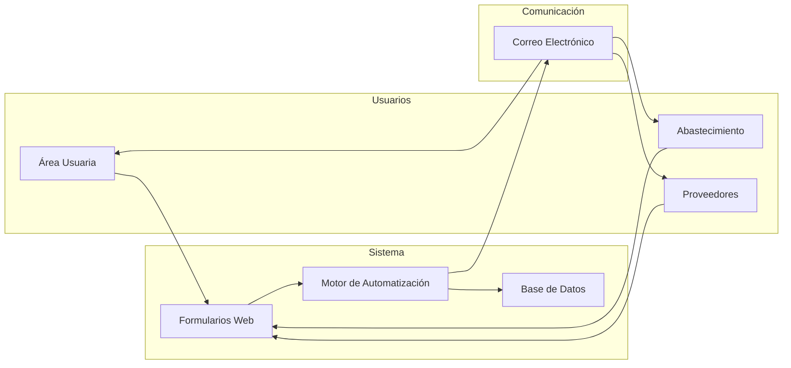

---

## 2. Arquitectura del Sistema

### 2.1 Visión General

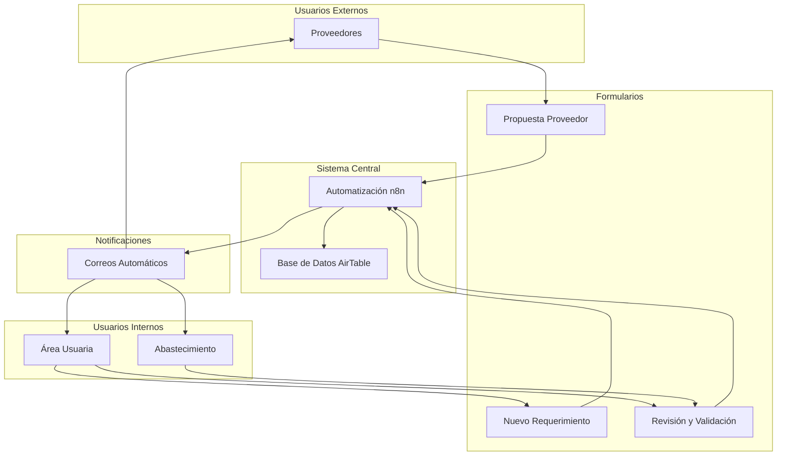

### 2.2 Actores del Sistema

| Actor | Rol | Acciones Principales |
|-------|-----|---------------------|
| **Área Usuaria** | Solicita la contratación | Inicia requerimiento, completa TDR/EETT, revisa documento, selecciona proveedores |
| **Abastecimiento** | Gestiona el proceso | Valida requerimientos, agrega proveedores, evalúa propuestas, otorga conformidad |
| **Proveedor** | Presenta propuesta | Recibe invitación, descarga documentos, carga propuesta, subsana observaciones |
| **Sistema** | Automatiza tareas | Genera documentos, asigna responsables, envía notificaciones, valida plazos |

---

## 3. Flujos del Proceso

### 3.1 Flujo General Completo

```mermaid
flowchart TB
    START((Inicio)) --> CHECK_UIT{Monto ≤ 8 UIT?}
    CHECK_UIT -->|No| END_REJECT((Fin - Rechazado))
    CHECK_UIT -->|Sí| CHECK_TYPE{Tipo de<br/>Requerimiento}
    
    CHECK_TYPE -->|Servicio| GEN_TDR[Generar TDR]
    CHECK_TYPE -->|Bienes| GEN_EETT[Generar EETT]
    CHECK_TYPE -->|Locación| GEN_TDR
    
    GEN_TDR --> REVIEW_DOC{¿Tiene<br/>Observaciones?}
    GEN_EETT --> REVIEW_DOC
    
    REVIEW_DOC -->|Sí| FIX_OBS[Corregir Observaciones]
    FIX_OBS --> COUNT_OBS{¿Intentos < 2?}
    COUNT_OBS -->|Sí| VALIDATE_OBS{¿Se aceptan<br/>correcciones?}
    COUNT_OBS -->|No, 2 intentos| AUTO_APPROVE[Aprobar Automáticamente]
    VALIDATE_OBS -->|No| FIX_OBS
    VALIDATE_OBS -->|Sí| ELABORATE_REQ
    AUTO_APPROVE --> ELABORATE_REQ
    REVIEW_DOC -->|No| ELABORATE_REQ[Elaborar Requerimiento]
    
    ELABORATE_REQ --> ASSIGN[Asignar Responsable<br/>Automáticamente]
    
    ASSIGN --> NOTIFY_RESP[Notificar al<br/>Responsable]
    
    NOTIFY_RESP --> VALIDATE_REQ{¿Requerimiento<br/>Conforme?}
    VALIDATE_REQ -->|No| SEND_OBS_REQ[Enviar Solicitud<br/>de Subsanación]
    SEND_OBS_REQ --> VALIDATE_REQ
    VALIDATE_REQ -->|Sí| CHECK_AMOUNT{Monto < 1 UIT?}
    
    CHECK_AMOUNT -->|Sí| SELECT_1[Seleccionar<br/>1 Proveedor]
    CHECK_AMOUNT -->|No| SELECT_2[Seleccionar<br/>≥2 Proveedores]
    
    SELECT_1 --> VERIFY_EMAILS{Verificar Correos<br/>de Proveedores}
    SELECT_2 --> VERIFY_EMAILS
    
    VERIFY_EMAILS -->|Válidos| SEND_PROV[Enviar a<br/>Proveedores]
    VERIFY_EMAILS -->|Inválidos| NOTIFY_INVALID[Notificar Correos<br/>Inválidos]
    NOTIFY_INVALID --> FIX_EMAILS[Corregir Correos]
    FIX_EMAILS --> VERIFY_EMAILS
    
    SEND_PROV --> PROV_REVIEW[Proveedor Revisa<br/>Requerimiento]
    PROV_REVIEW --> PROV_DOWNLOAD[Descarga Formatos]
    PROV_DOWNLOAD --> PROV_UPLOAD[Carga Propuesta]
    PROV_UPLOAD --> PROV_SEND[Envía Propuesta]
    
    PROV_SEND --> VALIDATE_PROP{¿Propuesta<br/>Conforme?}
    VALIDATE_PROP -->|No| SEND_OBS_PROV[Enviar Observaciones]
    SEND_OBS_PROV --> PROV_FIX[Proveedor Subsana]
    PROV_FIX --> VALIDATE_PROP
    
    VALIDATE_PROP -->|Sí| DOWNLOAD_PROP[Descargar Propuestas<br/>en Word]
    DOWNLOAD_PROP --> FINAL_VALIDATE[Validar Conformidad<br/>Final]
    
    FINAL_VALIDATE --> SEND_ACCEPT[Enviar Correo<br/>de Aceptación]
    SEND_ACCEPT --> END_SUCCESS((Fin - Exitoso))
```

### 3.2 Diagrama de Secuencia - Interacción entre Actores

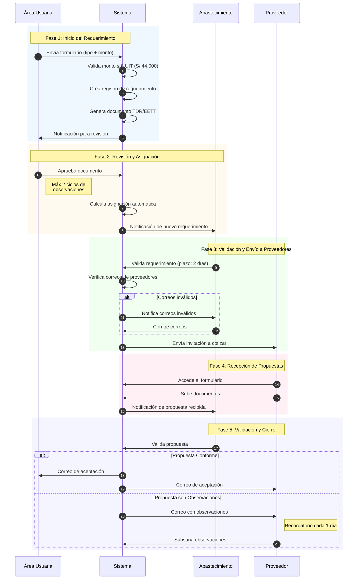

### 3.3 Flujo 1: Inicio de Requerimiento

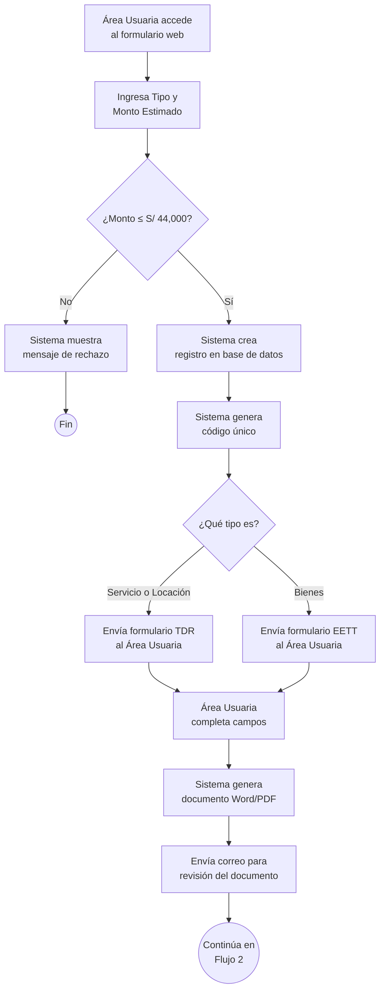

### 3.4 Flujo 2: Revisión y Observaciones

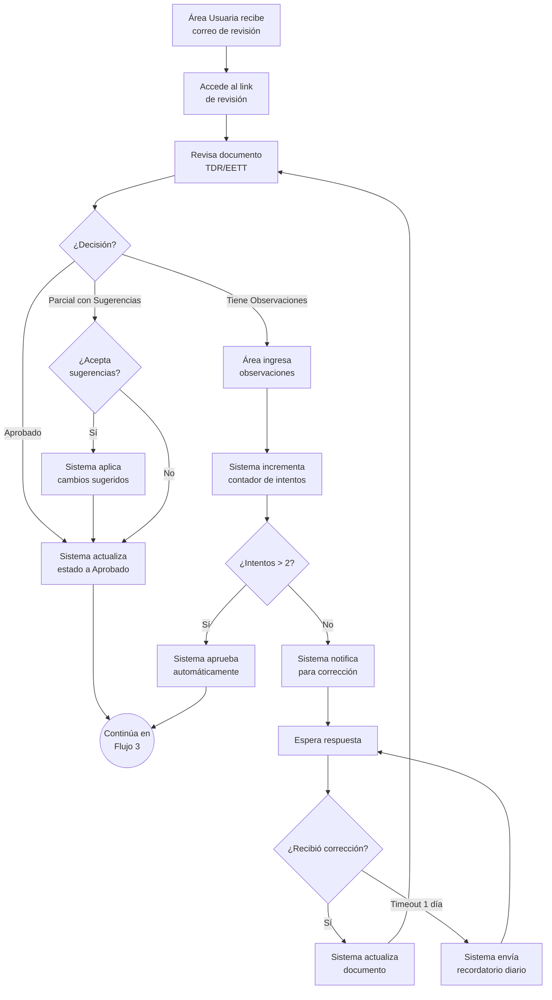

### 3.5 Flujo 3: Asignación Automática de Responsable

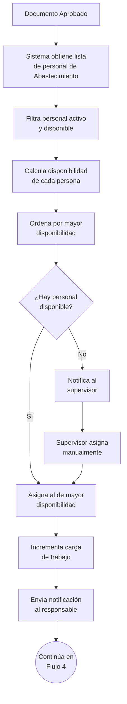

**Fórmula de asignación:**
```
Disponibilidad = Capacidad Máxima - Carga Actual
Se asigna a quien tenga mayor disponibilidad
```

### 3.6 Flujo 4: Validación por Abastecimiento

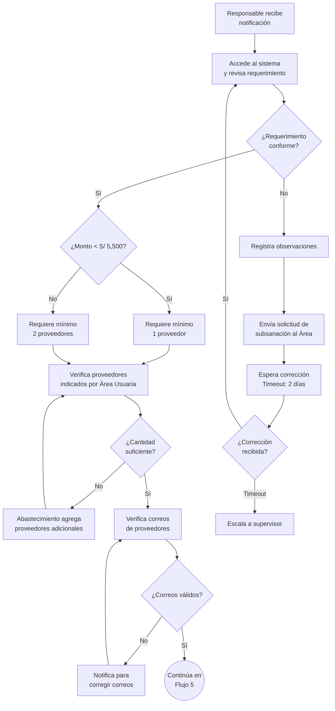

### 3.7 Flujo 5: Envío a Proveedores

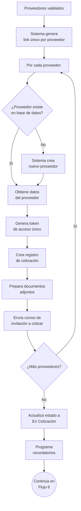

### 3.8 Flujo 6: Recepción de Propuestas del Proveedor

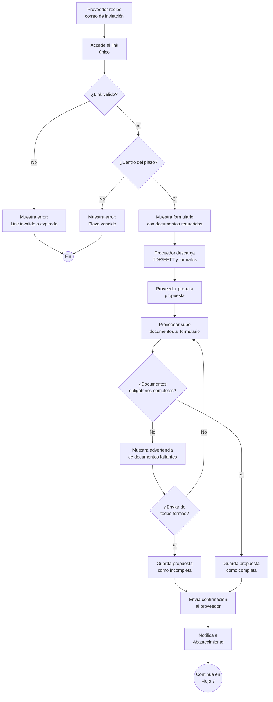

### 3.9 Flujo 7: Validación de Propuestas

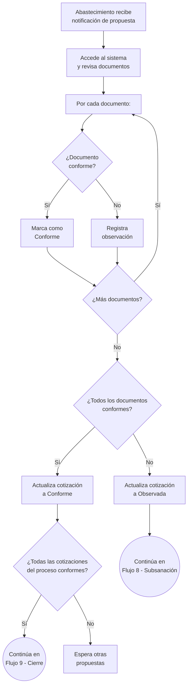

### 3.10 Flujo 8: Subsanación por Proveedor

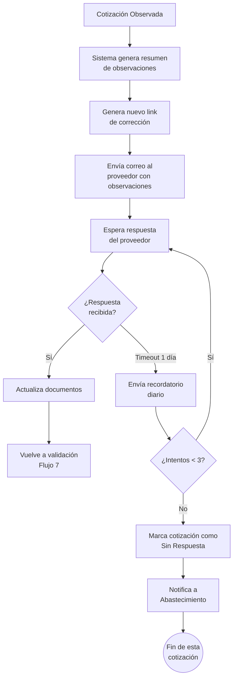

### 3.11 Flujo 9: Cierre y Notificación Final

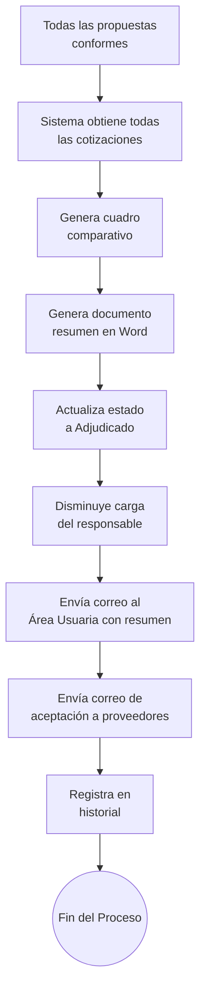

---

## 4. Estructura de Datos

### 4.1 Diagrama de Relaciones

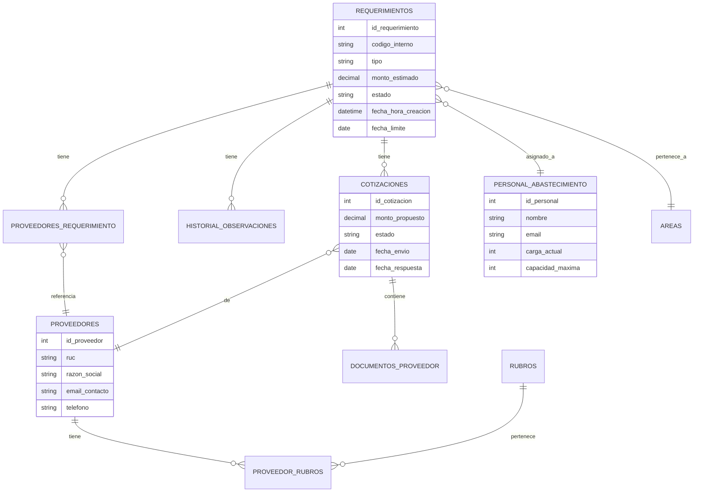

### 4.2 Tabla: Requerimientos

| Campo | Descripción | Ejemplo |
|-------|-------------|---------|
| Código Interno | Identificador único del requerimiento | REQ-2025-0001 |
| Tipo | Servicio / Bienes / Locación | Servicio |
| Monto Estimado | Valor en soles | S/ 15,000.00 |
| Estado | Estado actual del proceso | En Cotización |
| Área Solicitante | Área que solicita | Recursos Humanos |
| Responsable Asignado | Personal de Abastecimiento | Juan Pérez |
| Fecha y Hora de Creación | Cuándo se creó | 15/01/2025 10:30:45 |
| Fecha Límite | Fecha límite del proceso | 30/01/2025 |
| Documento TDR/EETT | Archivo generado | TDR_REQ-2025-0001.docx |
| Intentos de Corrección | Contador (máximo 2) | 0 |

**Estados posibles del requerimiento:**

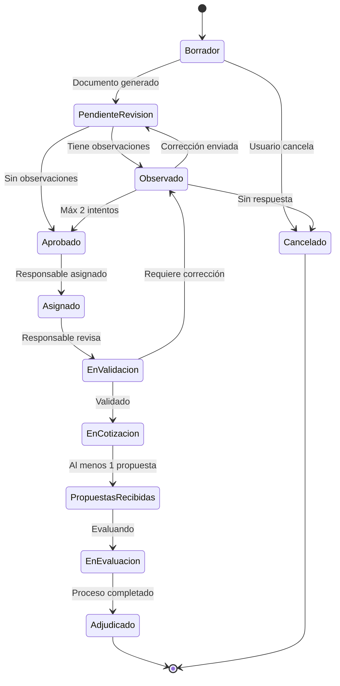

### 4.3 Tabla: Proveedores

| Campo | Descripción | Ejemplo |
|-------|-------------|---------|
| RUC | Registro único de contribuyente | 20123456789 |
| Razón Social | Nombre de la empresa | ABC Servicios S.A.C. |
| Email de Contacto | Correo principal | ventas@abc.com |
| Teléfono | Número de contacto | 987654321 |
| Rubros | Categorías de productos/servicios | Limpieza, Seguridad |
| Calificación | Valoración 1-5 estrellas | ⭐⭐⭐⭐ |
| Documentos Vigentes | Si tiene documentos al día | ✅ |

### 4.4 Tabla: Cotizaciones

| Campo | Descripción | Ejemplo |
|-------|-------------|---------|
| Código | Identificador de la cotización | REQ-2025-0001-COT-1 |
| Requerimiento | Referencia al requerimiento | REQ-2025-0001 |
| Proveedor | Referencia al proveedor | ABC S.A.C. |
| Monto Propuesto | Valor ofertado | S/ 12,500.00 |
| Estado | Estado de la cotización | Conforme |
| Fecha de Envío | Cuándo se envió invitación | 16/01/2025 |
| Fecha de Respuesta | Cuándo respondió | 20/01/2025 |
| Fecha Límite | Plazo máximo | 23/01/2025 |

**Estados de la cotización:**

| Estado | Descripción |
|--------|-------------|
| Pendiente Envío | Creada pero no enviada |
| Enviada | Correo enviado al proveedor |
| En Proceso | Proveedor accedió al formulario |
| Recibida | Propuesta recibida |
| Observada | Tiene observaciones |
| Conforme | Aprobada |
| Descartada | No seleccionada |
| Sin Respuesta | Venció el plazo |

### 4.5 Tabla: Personal de Abastecimiento

| Campo | Descripción | Ejemplo |
|-------|-------------|---------|
| Nombre | Nombre completo | Juan Pérez García |
| Email | Correo electrónico | jperez@municipalidad.gob.pe |
| Carga Actual | Requerimientos activos asignados | 5 |
| Capacidad Máxima | Máximo que puede atender | 10 |
| Disponibilidad | Capacidad - Carga (calculado) | 5 |
| Activo | Si está disponible | ✅ |

### 4.6 Documentos Requeridos por Tipo de Contratación

| Documento | Servicio | Bien | Locación |
|-----------|:--------:|:----:|:--------:|
| Declaración Jurada | ✅ | ✅ | ✅ |
| CV | ❌ | ❌ | ✅ |
| Experiencia del Postor | ✅ | ❌ | ❌ |
| RNP | ✅ | ✅ | ❌ |
| Ficha RUC | ✅ | ✅ | ✅ |
| Propuesta Técnica | ✅ | ✅ | ❌ |
| Propuesta Económica | ✅ | ✅ | ✅ |

---

## 5. Formularios

### 5.1 Formulario de Inicio de Requerimiento

**Objetivo:** Capturar los datos iniciales para comenzar el proceso.

**Campos:**

| Campo | Tipo | ¿Obligatorio? | Descripción |
|-------|------|:-------------:|-------------|
| Tipo de Requerimiento | Lista desplegable | ✅ | Servicio, Bienes o Locación |
| Monto Estimado | Moneda (S/) | ✅ | Máximo S/ 44,000 |

**Validación:** Si el monto excede S/ 44,000 (8 UIT), el sistema rechaza el requerimiento.

---

### 5.2 Formulario TDR (Términos de Referencia) - Para Servicios y Locación

**Objetivo:** Completar los campos del documento TDR.

**Secciones del formulario:**

| Sección | Campos | Tipo |
|---------|--------|------|
| **Encabezado** | Órgano/Unidad Orgánica | Texto editable |
| | Actividad del POI | Texto editable |
| | Denominación de la contratación | Texto editable |
| **1. Finalidad Pública** | Descripción del interés público | Texto largo |
| **2. Antecedentes** | Descripción de antecedentes | Texto largo |
| **3. Objetivos** | Objetivo General | Texto largo |
| | Objetivos Específicos | Texto largo |
| **4. Alcance** | Actividades | Texto largo |
| | Procedimiento | Texto largo |
| | Plan de trabajo | Texto largo |
| | Recursos del proveedor | Texto largo |
| **5. Requisitos** | Requisitos del proveedor/personal | Texto largo |
| **6. Seguros** | Seguros requeridos | Texto largo |
| **7. Lugar y Plazo** | Lugar de ejecución | Texto |
| | Plazo en días calendario | Número |
| **8. Entregables** | Resultados esperados | Texto largo |
| **9. Conformidad** | Procedimiento de conformidad | Texto largo |
| **10. Pago** | Forma y condiciones | Texto largo |
| **11-17** | Cláusulas legales | Texto fijo (no editable) |

---

### 5.3 Formulario EETT (Especificaciones Técnicas) - Para Bienes

**Objetivo:** Completar los campos del documento de especificaciones técnicas.

| Sección | Campos | Tipo |
|---------|--------|------|
| **Encabezado** | Órgano/Unidad Orgánica | Texto editable |
| | Actividad del POI | Texto editable |
| | Denominación de la contratación | Texto editable |
| **1. Finalidad Pública** | Descripción del interés público | Texto largo |
| **2. Antecedentes** | Descripción de antecedentes | Texto largo |
| **3. Objetivos** | Objetivo General y Específicos | Texto largo |
| **4. Descripción** | Características técnicas | Texto largo |
| | Condiciones de operación | Texto largo |
| | Embalaje y rotulado | Texto largo |
| | Normas técnicas | Texto largo |
| **5. Garantía** | Garantía comercial | Texto largo |
| **6. Muestras** | Requisitos de muestras | Texto largo |
| **7. Prestaciones** | Prestaciones accesorias | Texto largo |
| **8. Requisitos** | Requisitos del proveedor | Texto largo |
| **9. Lugar y Plazo** | Lugar y plazo de entrega | Texto + Número |
| **10-18** | Conformidad, pago, cláusulas | Texto fijo/editable |

---

### 5.4 Formulario de Revisión de Documento

**Objetivo:** Que el Área Usuaria revise y apruebe el documento generado.

| Campo | Tipo | Descripción |
|-------|------|-------------|
| Vista previa del documento | Solo lectura | Muestra el PDF generado |
| Decisión | Opción única | Aprobar / Tiene observaciones / Aceptar con sugerencias |
| Detalle de observaciones | Texto largo | Solo si tiene observaciones |
| Archivos de soporte | Adjuntos | Opcional |

---

### 5.5 Formulario de Validación por Abastecimiento

**Objetivo:** Que el responsable de Abastecimiento valide el requerimiento.

| Sección | Campo | Descripción |
|---------|-------|-------------|
| **Información** | Datos del requerimiento | Solo lectura |
| | Documento TDR/EETT | Vista previa |
| **Decisión** | ¿Conforme? | Sí / No |
| | Observaciones | Si no es conforme |
| **Proveedores** | Lista de proveedores del área usuaria | Solo lectura |
| | ¿Agregar más proveedores? | Sí / No |
| | Proveedores adicionales | De la base de datos o nuevos |
| **Confirmación** | Resumen de proveedores | Cantidad total |
| | Confirmar envío | Checkbox obligatorio |

---

### 5.6 Formulario de Propuesta del Proveedor

**Objetivo:** Que el proveedor cargue su propuesta.

| Sección | Campo | Descripción |
|---------|-------|-------------|
| **Información del proceso** | Código, descripción, tipo, fecha límite | Solo lectura |
| **Descargas** | TDR/EETT | Botón de descarga |
| | Formatos editables | Botón de descarga |
| **Propuesta económica** | Monto propuesto | Moneda (S/) |
| | Plazo de entrega | Días |
| | Vigencia de oferta | Días (default: 30) |
| **Documentos** | Según tipo de contratación | Archivos PDF |
| **Declaración** | Acepto términos | Checkbox obligatorio |

---

### 5.7 Formulario de Validación de Propuesta

**Objetivo:** Que Abastecimiento valide los documentos del proveedor.

| Sección | Campo | Descripción |
|---------|-------|-------------|
| **Información** | Datos de la cotización | Solo lectura |
| **Validación** | Por cada documento: | |
| | - Vista previa | Visualizador |
| | - Estado | Conforme / Observado |
| | - Observación | Si es observado |
| **Decisión final** | Propuesta conforme | Sí / No |
| | Comentarios | Texto libre |

---

## 6. Plantillas de Correo

### 6.1 Confirmación de Requerimiento

**Asunto:** [REQ-2025-XXXX] Requerimiento Registrado Exitosamente

```
Estimado/a [Nombre del Solicitante],

Su requerimiento ha sido registrado correctamente en el sistema.

═══════════════════════════════════════════
DATOS DEL REQUERIMIENTO
═══════════════════════════════════════════

Código: REQ-2025-XXXX
Tipo: [Servicio/Bienes/Locación]
Monto Estimado: S/ XX,XXX.XX
Fecha Límite: DD/MM/YYYY

═══════════════════════════════════════════

Próximos pasos:
1. Recibirá un correo para completar el documento TDR/EETT
2. Una vez completado, revisará y aprobará el documento
3. Se asignará a un responsable de Abastecimiento

Atentamente,
Sistema de Contrataciones
```

---

### 6.2 Solicitud de Revisión de Documento

**Asunto:** [REQ-2025-XXXX] Documento Listo para Revisión

```
Estimado/a [Nombre del Solicitante],

El documento [TDR/EETT] de su requerimiento está listo para revisión.

═══════════════════════════════════════════
ACCIÓN REQUERIDA
═══════════════════════════════════════════

Por favor revise el documento y apruébelo o indique las observaciones.

🔗 REVISAR DOCUMENTO:
[Link al formulario de revisión]

Este enlace estará vigente por 7 días.

═══════════════════════════════════════════

Código: REQ-2025-XXXX
Tipo: [Servicio/Bienes/Locación]

Atentamente,
Sistema de Contrataciones
```

---

### 6.3 Notificación de Asignación (Abastecimiento)

**Asunto:** [REQ-2025-XXXX] Nuevo Requerimiento Asignado

```
Estimado/a [Nombre del Responsable],

Se le ha asignado un nuevo requerimiento para gestión.

═══════════════════════════════════════════
DATOS DEL REQUERIMIENTO
═══════════════════════════════════════════

Código: REQ-2025-XXXX
Tipo: [Servicio/Bienes/Locación]
Área Solicitante: [Nombre del Área]
Monto Estimado: S/ XX,XXX.XX
Fecha Límite: DD/MM/YYYY

═══════════════════════════════════════════
SU CARGA DE TRABAJO ACTUAL
═══════════════════════════════════════════

Requerimientos asignados: X / Y

🔗 VALIDAR REQUERIMIENTO:
[Link al formulario de validación]

Atentamente,
Sistema de Contrataciones
```

---

### 6.4 Invitación a Cotizar (Proveedor)

**Asunto:** Invitación a Cotizar - REQ-2025-XXXX [Nombre del Requerimiento]

```
La Subgerencia de Abastecimientos como Dependencia Encargada de las 
Contrataciones, invita a las personas naturales y/o jurídicas a formular 
y presentar su cotización según Términos de Referencia adjunto.

Estimados Señores,
[Razón Social del Proveedor]

═══════════════════════════════════════════
DATOS DEL PROCESO
═══════════════════════════════════════════

Código: REQ-2025-XXXX
Objeto: [Descripción corta]
Tipo: [Servicio/Bienes/Locación]

FECHA LÍMITE DE PRESENTACIÓN: DD/MM/YYYY

═══════════════════════════════════════════
DOCUMENTOS DEL PROCESO
═══════════════════════════════════════════

En el siguiente enlace encontrará:
• Términos de Referencia / Especificaciones Técnicas
• Formatos editables para su propuesta
• Formulario para cargar su propuesta

🔗 ACCEDER AL PROCESO:
[Link único del proveedor]

═══════════════════════════════════════════
DOCUMENTOS REQUERIDOS
═══════════════════════════════════════════

📋 Cotización o proforma, debe contener:
   • Nº de Cotización
   • RUC y Razón social
   • Domicilio fiscal
   • Firma del representante legal
   • Teléfono y correo electrónico
   • CCI

📎 Adjuntar:
   • FICHA RUC
   • RNP (de corresponder)
   • F012 - DJ SERVICIOS

═══════════════════════════════════════════

IMPORTANTE:
• El enlace es de uso único y exclusivo para su empresa
• Asegúrese de cargar todos los documentos obligatorios

La documentación también puede enviarse a:
📧 cotizaciones03cajabamba@gmail.com

Atentamente,

SUB GERENTE DE ABASTECIMIENTOS
MUNICIPALIDAD PROVINCIAL DE CAJABAMBA
```

---

### 6.5 Confirmación de Propuesta Recibida

**Asunto:** Propuesta Recibida - REQ-2025-XXXX

```
Estimados Señores,
[Razón Social]

Confirmamos la recepción de su propuesta.

═══════════════════════════════════════════
RESUMEN DE SU PROPUESTA
═══════════════════════════════════════════

Fecha de Recepción: DD/MM/YYYY HH:MM
Monto Propuesto: S/ XX,XXX.XX
Plazo de Entrega: XX días

Documentos Recibidos:
✅ Declaración Jurada
✅ Ficha RUC
✅ Propuesta Económica
[...]

═══════════════════════════════════════════

Su propuesta será evaluada y recibirá una comunicación con el resultado.

Atentamente,
Área de Abastecimiento
```

---

### 6.6 Observaciones a Propuesta

**Asunto:** Observaciones a su Propuesta - REQ-2025-XXXX

```
Estimados Señores,
[Razón Social]

Luego de la revisión, se identificaron las siguientes observaciones:

═══════════════════════════════════════════
OBSERVACIONES
═══════════════════════════════════════════

📌 [Documento 1]:
   [Detalle de la observación]

📌 [Documento 2]:
   [Detalle de la observación]

═══════════════════════════════════════════
PLAZO DE SUBSANACIÓN
═══════════════════════════════════════════

Tiene hasta el DD/MM/YYYY para subsanar las observaciones.

🔗 SUBSANAR OBSERVACIONES:
[Link de subsanación]

═══════════════════════════════════════════

De no subsanar en el plazo indicado, su propuesta podría ser descartada.

Atentamente,
Área de Abastecimiento
```

---

### 6.7 Aceptación de Propuesta

**Asunto:** ✅ Propuesta Aceptada - REQ-2025-XXXX

```
Estimados Señores,
[Razón Social]

Nos es grato comunicarles que su propuesta ha sido ACEPTADA.

═══════════════════════════════════════════
DATOS DE LA CONTRATACIÓN
═══════════════════════════════════════════

Código: REQ-2025-XXXX
Objeto: [Descripción]
Monto Adjudicado: S/ XX,XXX.XX
Plazo de Ejecución: XX días

═══════════════════════════════════════════
PRÓXIMOS PASOS
═══════════════════════════════════════════

El área usuaria se comunicará con ustedes para coordinar 
los detalles de la ejecución.

Contacto del Área Usuaria:
[Nombre]
[Email]
[Teléfono]

═══════════════════════════════════════════

Agradecemos su participación.

Atentamente,
Área de Abastecimiento
```

---

### 6.8 Notificación Final al Área Usuaria

**Asunto:** ✅ Proceso Completado - REQ-2025-XXXX

```
Estimado/a [Nombre del Solicitante],

El proceso de contratación ha sido completado exitosamente.

═══════════════════════════════════════════
RESULTADO DEL PROCESO
═══════════════════════════════════════════

Proveedor Seleccionado: [Razón Social]
RUC: [RUC]
Monto: S/ XX,XXX.XX
Plazo de Entrega: XX días

═══════════════════════════════════════════
CONTACTO DEL PROVEEDOR
═══════════════════════════════════════════

Email: [email]
Teléfono: [teléfono]

═══════════════════════════════════════════

📎 Se adjunta:
   • Cuadro Comparativo
   • Propuesta del Proveedor

Por favor coordine directamente con el proveedor.

Atentamente,
Área de Abastecimiento
```

---

## 7. Reglas de Negocio

### 7.1 Límites y Umbrales

| Concepto | Valor |
|----------|-------|
| 1 UIT (2025) | S/ 5,500 |
| 8 UIT - Límite del proceso | S/ 44,000 |
| Monto < 1 UIT | Requiere mínimo 1 proveedor |
| Monto ≥ 1 UIT | Requiere mínimo 2 proveedores |

### 7.2 Tiempos y Plazos

| Actividad | Plazo | Acción si vence |
|-----------|-------|-----------------|
| Revisión de documento por Área Usuaria | 1 día | Recordatorio diario |
| Corrección de observaciones | Máx 2 intentos | Aprobación automática |
| Validación por Abastecimiento | 2 días | Escalar a supervisor |
| Respuesta del proveedor a invitación | Según fecha límite | Marcar sin respuesta |
| Subsanación de observaciones por proveedor | 1 día | Recordatorio diario (máx 3) |

### 7.3 Asignación Automática de Responsables

El sistema asigna automáticamente el requerimiento al personal de Abastecimiento con mayor disponibilidad:

```
Disponibilidad = Capacidad Máxima - Carga Actual
```

Se selecciona a quien tenga el valor más alto de disponibilidad.

### 7.4 Validación de Correos

Antes de enviar invitaciones a proveedores, el sistema verifica:

1. ✅ Formato válido de correo electrónico
2. ✅ El dominio del correo existe
3. ✅ El dominio tiene servidor de correo configurado

Si algún correo no es válido, se notifica a Abastecimiento para corrección.

---

## 8. Costos del Proyecto

### 8.1 Costos de Infraestructura (Mensual)

**Opción A: VPS (Recomendada)**

| Componente | Especificación | Costo Mensual |
|------------|----------------|---------------|
| Servidor VPS (Hetzner/Contabo) | 4 vCPU, 8GB RAM, 200GB SSD | $20 - $30 |
| Dominio | .gob.pe o similar | ~$2 |
| **Total Mensual** | | **$22 - $32** |
| **Total Anual** | | **$264 - $384** |

**Opción B: AWS (Mayor escalabilidad)**

| Componente | Especificación | Costo Mensual |
|------------|----------------|---------------|
| EC2 (t3.medium) | 2 vCPU, 4GB RAM | ~$30 |
| RDS PostgreSQL | db.t3.micro | ~$15 |
| S3 Storage | ~12 GB/año documentos | ~$3 |
| SES (Correos) | ~1,900 correos/mes pico | ~$2 |
| CloudWatch | Monitoreo básico | ~$5 |
| **Total Mensual** | | **$55 - $70** |
| **Total Anual** | | **$660 - $840** |

### 8.2 Costos de Licencias

| Servicio | Plan | Costo |
|----------|------|-------|
| **n8n** | Self-hosted (código abierto) | **Gratis** |
| **AirTable** | Team (hasta 50,000 registros) | $20/usuario/mes |
| | Estimado 5 usuarios | $100/mes |
| **Google Workspace** | Para Google Docs API | $6/usuario/mes (si no tienen) |

**Alternativa AirTable:** Si el volumen crece, migrar a PostgreSQL (incluido en VPS) = $0 adicional

### 8.3 Costos de Implementación (Único)

| Concepto | Descripción | Costo Estimado |
|----------|-------------|----------------|
| Desarrollo e integración | Configuración de n8n, AirTable, plantillas | $3,000 - $5,000 |
| Migración de datos | Carga de proveedores existentes | $500 - $1,000 |
| Capacitación | 3 sesiones (Área Usuaria, Abastecimiento, Supervisores) | $500 - $800 |
| Documentación | Manuales de usuario | $300 - $500 |
| **Total Implementación** | | **$4,300 - $7,300** |

### 8.4 Costos de Mantenimiento (Anual)

| Concepto | Descripción | Costo Anual |
|----------|-------------|-------------|
| Soporte técnico | Corrección de errores, actualizaciones | $1,200 - $2,400 |
| Mejoras menores | Ajustes a flujos, nuevos reportes | $600 - $1,200 |
| Backups y seguridad | Monitoreo y respaldos | Incluido en infraestructura |
| **Total Mantenimiento** | | **$1,800 - $3,600** |

### 8.5 Resumen de Costos

**Primer Año (Implementación + Operación):**

| Concepto | Opción VPS | Opción AWS |
|----------|------------|------------|
| Implementación (único) | $4,300 - $7,300 | $4,300 - $7,300 |
| Infraestructura (12 meses) | $264 - $384 | $660 - $840 |
| AirTable (12 meses) | $1,200 | $1,200 |
| **Total Año 1** | **$5,764 - $8,884** | **$6,160 - $9,340** |

**Años Siguientes (Solo Operación):**

| Concepto | Opción VPS | Opción AWS |
|----------|------------|------------|
| Infraestructura | $264 - $384 | $660 - $840 |
| AirTable | $1,200 | $1,200 |
| Mantenimiento | $1,800 - $3,600 | $1,800 - $3,600 |
| **Total Anual** | **$3,264 - $5,184** | **$3,660 - $5,640** |

### 8.6 Retorno de Inversión (ROI)

| Beneficio | Ahorro Estimado |
|-----------|-----------------|
| Reducción de tiempo administrativo (60%) | ~200 horas/mes |
| Eliminación de errores de transcripción | Incuantificable |
| Reducción de papel y almacenamiento | ~$100/mes |
| Mejor control y auditoría | Reducción de riesgos |

**Tiempo estimado de recuperación:** 6-8 meses considerando eficiencias operativas.

---

## 9. Cronograma de Implementación

### 9.1 Fases del Proyecto

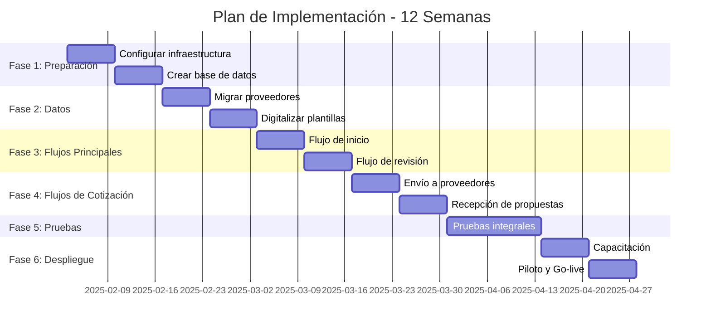

### 9.2 Resumen por Semanas

| Semana | Actividades |
|--------|-------------|
| 1-2 | Configuración de infraestructura y base de datos |
| 3-4 | Migración de datos y digitalización de plantillas |
| 5-6 | Desarrollo de flujos de inicio y revisión |
| 7-8 | Desarrollo de flujos de cotización y propuestas |
| 9-10 | Pruebas integrales y corrección de errores |
| 11-12 | Capacitación a usuarios y puesta en producción |

### 9.3 Capacitación Requerida

| Grupo | Duración | Temas |
|-------|----------|-------|
| **Área Usuaria** | 2 horas | Crear requerimientos, completar TDR/EETT, revisar documentos |
| **Abastecimiento** | 4 horas | Validar requerimientos, gestionar proveedores, evaluar propuestas |
| **Supervisores** | 2 horas | Dashboard de seguimiento, escalamiento, reportes |

---

## 10. Anexos

### 10.1 Glosario de Términos

| Término | Definición |
|---------|------------|
| **UIT** | Unidad Impositiva Tributaria (2025: S/ 5,500) |
| **TDR** | Términos de Referencia (documento para servicios) |
| **EETT** | Especificaciones Técnicas (documento para bienes) |
| **RNP** | Registro Nacional de Proveedores |
| **RUC** | Registro Único de Contribuyentes |
| **Locación** | Contratación de servicios personales |
| **n8n** | Plataforma de automatización de procesos |
| **AirTable** | Base de datos en la nube |

### 10.2 Valores de Referencia 2025

| Concepto | Valor |
|----------|-------|
| 1 UIT | S/ 5,500 |
| 8 UIT (límite del proceso) | S/ 44,000 |
| Contratación < 1 UIT | S/ 5,499.99 (1 proveedor mínimo) |
| Contratación ≥ 1 UIT | S/ 5,500 a S/ 44,000 (2+ proveedores) |

### 10.3 Cuadro Comparativo de Propuestas (Ejemplo)

| Criterio | Proveedor A | Proveedor B | Proveedor C |
|----------|-------------|-------------|-------------|
| Razón Social | ABC S.A.C. | XYZ E.I.R.L. | DEF S.R.L. |
| RUC | 20123456789 | 20987654321 | 20456789123 |
| Monto Propuesto | S/ 12,500 | S/ 13,200 | S/ 11,800 |
| Plazo de Entrega | 15 días | 10 días | 20 días |
| RNP Vigente | ✅ | ✅ | ✅ |
| Documentos Completos | ✅ | ✅ | ✅ |

---

## Control de Versiones

| Versión | Fecha | Cambios |
|---------|-------|---------|
| 1.0 | Febrero 2025 | Documento inicial |

---

*Documento elaborado para la Municipalidad Provincial de Cajabamba*  
*Sistema de Gestión de Contrataciones Menores a 8 UIT*