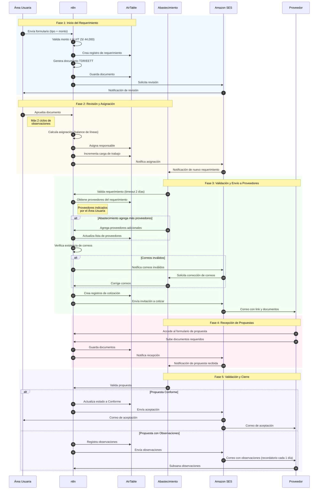
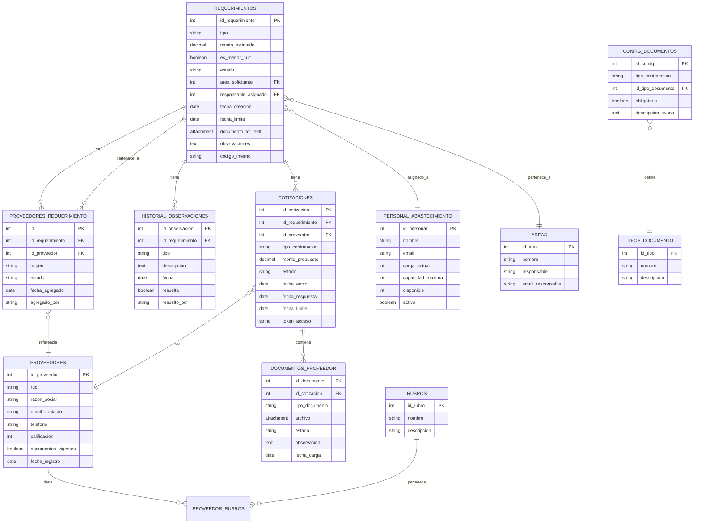
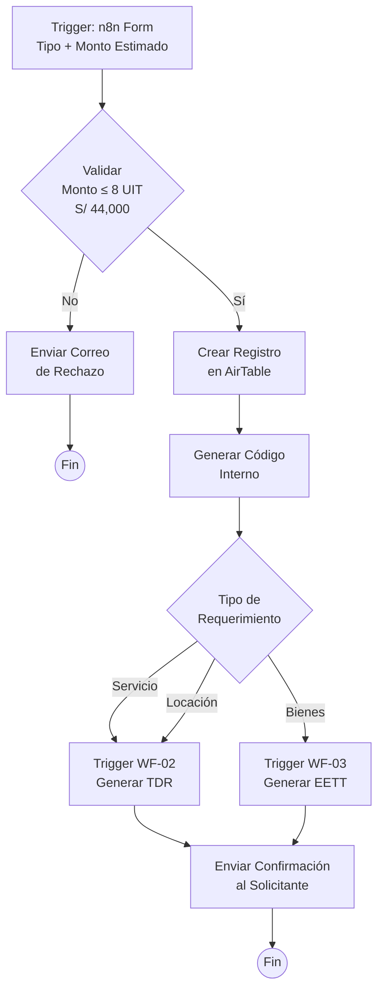
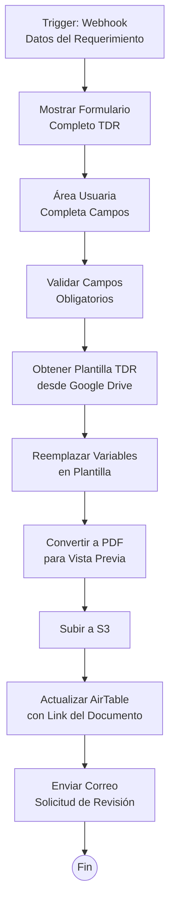
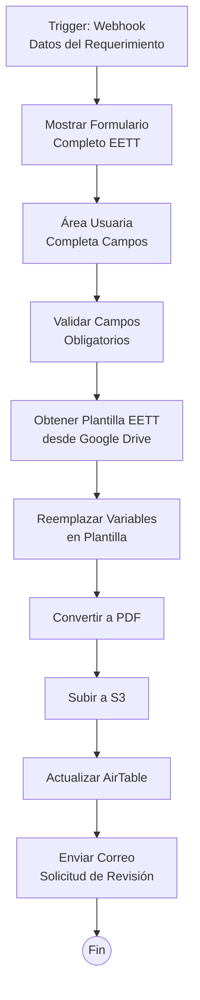
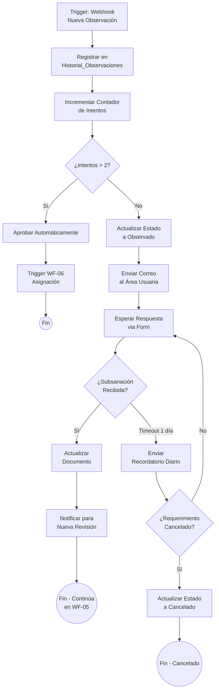
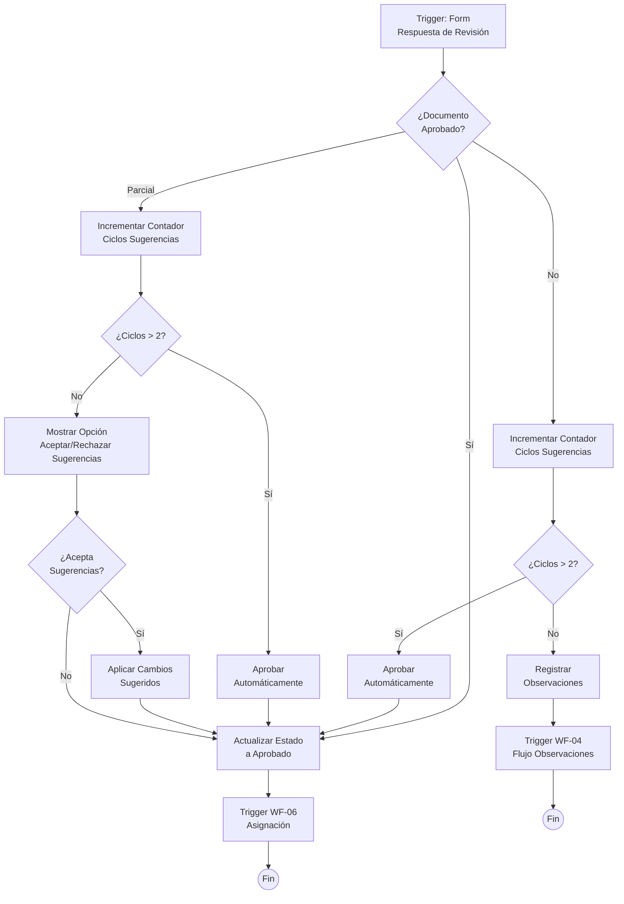
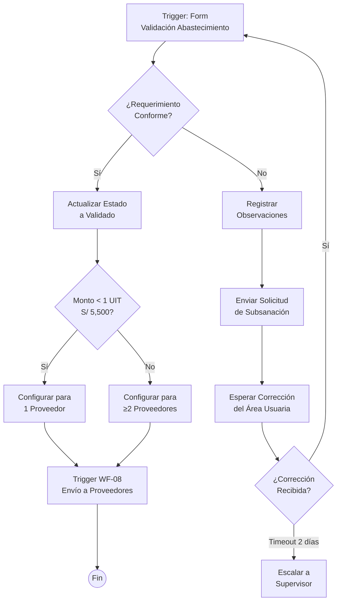
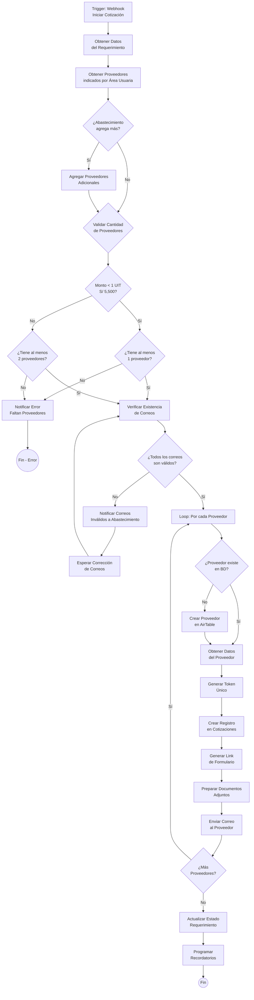
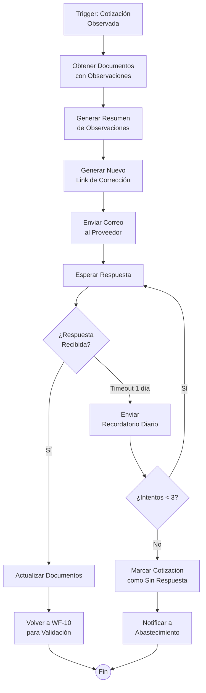

# Documento Técnico: Automatización del Proceso de Contratación Menores a 8 UIT

## Sistema de Gestión de Contrataciones con n8n y AirTable

**Versión:** 1.0  
**Fecha:** Enero 2025  
**Estado:** Borrador para Revisión

---

## Tabla de Contenidos

1. [Resumen Ejecutivo](#1-resumen-ejecutivo)
2. [Arquitectura del Sistema](#2-arquitectura-del-sistema)
3. [Infraestructura Técnica](#3-infraestructura-técnica)
4. [Estructura de Datos - AirTable](#4-estructura-de-datos---airtable)
5. [Workflows n8n](#5-workflows-n8n)
6. [Formularios](#6-formularios)
7. [Plantillas de Correo](#7-plantillas-de-correo)
8. [Configuración del Servidor](#8-configuración-del-servidor)
9. [Seguridad](#9-seguridad)
10. [Plan de Implementación](#10-plan-de-implementación)
11. [Anexos](#11-anexos)

---

## 1. Resumen Ejecutivo

### 1.1 Objetivo

Automatizar el proceso de contratación para adquisiciones menores a 8 UIT, reduciendo tiempos de gestión, eliminando errores manuales y proporcionando trazabilidad completa del proceso.

### 1.2 Alcance

| Aspecto | Detalle |
|---------|---------|
| **Procesos cubiertos** | Contratación de Servicios, Bienes y Locación de Servicios |
| **Actores** | Área Usuaria, Abastecimiento, Proveedores |
| **Volumen esperado** | 200-300 requerimientos/mes (pico), 80 requerimientos/mes (regular) |
| **Usuarios** | 30-40 usuarios internos |

### 1.3 Componentes Principales


### 1.4 Beneficios Esperados

- **Reducción de tiempo**: 60-70% menos tiempo en gestión administrativa
- **Trazabilidad**: 100% de las acciones registradas y auditables
- **Asignación inteligente**: Distribución automática de carga de trabajo
- **Cumplimiento**: Validación automática de documentos requeridos
- **Visibilidad**: Dashboards en tiempo real del estado de procesos

---

## 2. Arquitectura del Sistema

### 2.1 Diagrama de Arquitectura General


### 2.2 Flujo General del Proceso


### 2.3 Diagrama de Secuencia - Flujo Principal



---

## 3. Infraestructura Técnica

### 3.1 Especificaciones del Servidor

#### Opción Recomendada: VPS (Hetzner/Contabo)

| Componente | Especificación |
|------------|----------------|
| **CPU** | 4 vCPU |
| **RAM** | 8 GB |
| **Almacenamiento** | 200 GB SSD NVMe |
| **Sistema Operativo** | Ubuntu 24.04 LTS |
| **Ubicación** | USA o Europa |
| **Costo estimado** | $20-30 USD/mes |

#### Servicios Adicionales

| Servicio | Propósito | Costo Estimado |
|----------|-----------|----------------|
| **Amazon SES** | Correos transaccionales | ~$1/mes (1000 correos) |
| **Amazon S3** | Almacenamiento de documentos | ~$5-10/mes |
| **Cloudflare** | DNS, SSL, CDN, Protección | Gratis |
| **AirTable Team** | Base de datos | ~$20/usuario/mes |
| **Dominio** | URL para formularios | ~$12/año |

### 3.2 Diagrama de Infraestructura


### 3.3 Estimación de Recursos

#### Almacenamiento (Anual)

| Concepto | Cálculo | Tamaño Estimado |
|----------|---------|-----------------|
| Documentos TDR/EETT | 1,500 req × 500KB | 750 MB |
| Propuestas proveedores | 1,500 × 3 prov × 2MB | 9 GB |
| Documentos anexos | 4,500 × 500KB | 2.25 GB |
| **Total anual** | | **~12 GB** |

#### Correos (Mensual - Pico)

| Tipo | Cantidad |
|------|----------|
| Notificaciones internas | ~600 |
| Invitaciones a proveedores | ~900 |
| Confirmaciones y recordatorios | ~400 |
| **Total mensual (pico)** | **~1,900** |

---

## 4. Estructura de Datos - AirTable

### 4.1 Diagrama Entidad-Relación



### 4.2 Detalle de Tablas

#### Tabla: `Requerimientos`

| Campo | Tipo | Descripción | Ejemplo |
|-------|------|-------------|---------|
| `id_requerimiento` | Autonumber | Identificador único | 1001 |
| `codigo_interno` | Formula | Código legible | REQ-2025-0001 |
| `tipo` | Single Select | Servicio / Bienes / Locación | Servicio |
| `monto_estimado` | Currency | Monto en soles | S/ 15,000.00 |
| `es_menor_1uit` | Formula | `IF(monto_estimado < 5150, TRUE, FALSE)` | FALSE |
| `estado` | Single Select | Estado actual | En Cotización |
| `area_solicitante` | Link | Relación a Áreas | Recursos Humanos |
| `responsable_asignado` | Link | Relación a Personal | Juan Pérez |
| `fecha_hora_creacion` | Created Time | Fecha y hora automático | 15/01/2025 10:30:45 |
| `fecha_limite` | Date | Solo fecha límite de proceso | 30/01/2025 |
| `documento_tdr_eett` | Attachment | Documento generado | TDR_REQ-2025-0001.docx |
| `observaciones` | Long Text | Observaciones generales | - |
| `intentos_correccion` | Number | Contador de correcciones (máx 2) | 0 |

**Campos específicos del TDR/EETT (se muestran según tipo):**

| Campo | Tipo | Descripción |
|-------|------|-------------|
| `organo_unidad_organica` | Text | Órgano y/o Unidad Orgánica |
| `actividad_poi_pei` | Text | Actividad del POI / Acción Estratégica PEI |
| `denominacion_contratacion` | Text | Denominación de la contratación |
| `finalidad_publica` | Long Text | Interés público a satisfacer |
| `antecedentes` | Long Text | Antecedentes de la necesidad |
| `objetivo_general` | Long Text | Objetivo general de la contratación |
| `objetivo_especifico` | Long Text | Objetivos específicos |
| `alcance_descripcion` | Long Text | Alcance y descripción del servicio/bien |
| `actividades` | Long Text | Actividades a desarrollar (Servicios) |
| `procedimiento` | Long Text | Procedimiento a seguir (Servicios) |
| `plan_trabajo` | Long Text | Plan de trabajo (Servicios) |
| `recursos_proveedor` | Long Text | Recursos del proveedor |
| `caracteristicas_tecnicas` | Long Text | Características técnicas (Bienes) |
| `condiciones_operacion` | Long Text | Condiciones de operación (Bienes) |
| `embalaje_rotulado` | Long Text | Embalaje y rotulado (Bienes) |
| `reglamentos_tecnicos` | Long Text | Reglamentos técnicos, normas metrológicas |
| `normas_tecnicas` | Long Text | Normas técnicas aplicables |
| `seguros` | Long Text | Seguros requeridos |
| `prestaciones_accesorias` | Long Text | Prestaciones accesorias |
| `requisitos_proveedor` | Long Text | Requisitos del proveedor y/o personal |
| `lugar_ejecucion` | Text | Lugar de ejecución/entrega |
| `plazo_ejecucion` | Text | Plazo de ejecución en días calendario |
| `resultados_entregables` | Long Text | Resultados esperados y entregables |
| `conformidad` | Long Text | Procedimiento de conformidad |
| `forma_pago` | Long Text | Forma y condiciones de pago |
| `garantia_comercial` | Long Text | Garantía comercial (Bienes) |
| `vicios_ocultos` | Long Text | Responsabilidad por vicios ocultos |
| `confidencialidad` | Long Text | Cláusula de confidencialidad |
| `penalidad_mora` | Long Text | Penalidad por mora |
| `otras_penalidades` | Long Text | Otras penalidades |
| `solucion_controversias` | Long Text | Cláusula de solución de controversias |
| `clausula_anticorrupcion` | Long Text | Cláusula anticorrupción y antisoborno |
| `resolucion_contrato` | Long Text | Condiciones de resolución de contrato |

**Estados posibles:**
- `Borrador` - Recién creado
- `Pendiente Revisión` - Esperando revisión del área
- `Observado` - Tiene observaciones por subsanar
- `Aprobado` - Documento aprobado por área usuaria
- `Asignado` - Responsable de abastecimiento asignado
- `En Validación` - Abastecimiento validando
- `En Cotización` - Enviado a proveedores
- `Propuestas Recibidas` - Al menos una propuesta recibida
- `En Evaluación` - Evaluando propuestas
- `Adjudicado` - Proceso completado
- `Cancelado` - Proceso cancelado

#### Tabla: `Proveedores_Requerimiento`

Esta tabla relaciona los proveedores indicados por el área usuaria (o agregados por Abastecimiento) con cada requerimiento.

| Campo | Tipo | Descripción |
|-------|------|-------------|
| `id` | Autonumber | ID único |
| `requerimiento` | Link | Relación a Requerimientos |
| `proveedor` | Link | Relación a Proveedores |
| `origen` | Single Select | Quién agregó al proveedor |
| `estado` | Single Select | Estado del proveedor en el proceso |
| `fecha_agregado` | Created Time | Fecha de registro |
| `agregado_por` | Text | Nombre/email de quien agregó |
| `notas` | Long Text | Notas adicionales |

**Valores de `origen`:**
- `Área Usuaria - BD` - Seleccionado de la base de datos por el área
- `Área Usuaria - Nuevo` - Proveedor nuevo agregado por el área
- `Abastecimiento - BD` - Agregado por Abastecimiento de la BD
- `Abastecimiento - Nuevo` - Proveedor nuevo agregado por Abastecimiento

**Estados del proveedor en el requerimiento:**
- `Pendiente` - Aún no se envía invitación
- `Invitado` - Se envió correo de invitación
- `Participando` - Proveedor accedió al formulario
- `Propuesta Recibida` - Envió su propuesta
- `Descartado` - No participará (por decisión propia o del proceso)

#### Tabla: `Personal_Abastecimiento`

| Campo | Tipo | Descripción |
|-------|------|-------------|
| `id_personal` | Autonumber | ID único |
| `nombre` | Text | Nombre completo |
| `email` | Email | Correo electrónico |
| `carga_actual` | Number | Requerimientos activos asignados |
| `capacidad_maxima` | Number | Capacidad máxima de atención |
| `disponible` | Formula | `capacidad_maxima - carga_actual` |
| `activo` | Checkbox | Si está disponible para asignación |
| `especialidades` | Multiple Select | Tipos de contratación que maneja |

#### Tabla: `Proveedores`

| Campo | Tipo | Descripción |
|-------|------|-------------|
| `id_proveedor` | Autonumber | ID único |
| `ruc` | Text | RUC del proveedor |
| `razon_social` | Text | Razón social |
| `nombre_comercial` | Text | Nombre comercial (opcional) |
| `email_contacto` | Email | Correo principal |
| `email_secundario` | Email | Correo alternativo |
| `telefono` | Phone | Teléfono de contacto |
| `direccion` | Text | Dirección fiscal |
| `rubros` | Link | Relación múltiple a Rubros |
| `calificacion` | Rating | Calificación 1-5 |
| `documentos_vigentes` | Checkbox | Si tiene documentos al día |
| `rnp_vigente` | Date | Fecha de vigencia RNP |
| `notas` | Long Text | Notas internas |

#### Tabla: `Cotizaciones`

| Campo | Tipo | Descripción |
|-------|------|-------------|
| `id_cotizacion` | Autonumber | ID único |
| `codigo` | Formula | `CONCATENATE(requerimiento.codigo, "-COT-", id_cotizacion)` |
| `requerimiento` | Link | Relación a Requerimientos |
| `proveedor` | Link | Relación a Proveedores |
| `tipo_contratacion` | Single Select | Servicio / Bien / Locación |
| `monto_propuesto` | Currency | Monto de la propuesta |
| `estado` | Single Select | Estado de la cotización |
| `fecha_envio` | Date | Fecha de envío al proveedor |
| `fecha_limite` | Date | Fecha límite de respuesta |
| `fecha_respuesta` | Date | Fecha en que respondió |
| `token_acceso` | Text | Token único para el formulario |
| `link_formulario` | Formula | URL del formulario con token |
| `documentos_completos` | Rollup | Cuenta de documentos conformes |
| `documentos_requeridos` | Rollup | Total de documentos requeridos |
| `porcentaje_avance` | Formula | `documentos_completos / documentos_requeridos * 100` |

**Estados de cotización:**
- `Pendiente Envío` - Creada pero no enviada
- `Enviada` - Correo enviado al proveedor
- `En Proceso` - Proveedor accedió al formulario
- `Recibida` - Propuesta recibida
- `Observada` - Tiene observaciones
- `Conforme` - Aprobada
- `Descartada` - No seleccionada
- `Sin Respuesta` - Venció el plazo

#### Tabla: `Documentos_Proveedor`

| Campo | Tipo | Descripción |
|-------|------|-------------|
| `id_documento` | Autonumber | ID único |
| `cotizacion` | Link | Relación a Cotizaciones |
| `tipo_documento` | Single Select | Tipo de documento |
| `archivo` | Attachment | Archivo subido |
| `estado` | Single Select | Pendiente/Recibido/Observado/Conforme |
| `observacion` | Long Text | Observaciones si las hay |
| `fecha_carga` | Created Time | Fecha de carga |
| `validado_por` | Link | Quién validó |
| `fecha_validacion` | Date | Cuándo se validó |

**Tipos de documento:**
- Declaración Jurada
- Curriculum Vitae (Locadores)
- Experiencia del Postor
- Constancia RNP
- Ficha RUC
- Propuesta Técnica
- Propuesta Económica
- Carta de Presentación
- Otros

#### Tabla: `Configuracion_Documentos`

| Campo | Tipo | Descripción |
|-------|------|-------------|
| `id_config` | Autonumber | ID único |
| `tipo_contratacion` | Single Select | Servicio / Bien / Locación |
| `tipo_documento` | Single Select | Tipo de documento |
| `obligatorio` | Checkbox | Si es requerido |
| `descripcion_ayuda` | Long Text | Texto de ayuda para el proveedor |
| `plantilla` | Attachment | Plantilla descargable |

**Configuración por defecto:**

| Documento | Servicio | Bien | Locación |
|-----------|:--------:|:----:|:--------:|
| Declaración Jurada | ✅ | ✅ | ✅ |
| CV | ❌ | ❌ | ✅ |
| Experiencia del Postor | ✅ | ❌ | ❌ |
| RNP | ✅ | ✅ | ❌ |
| Ficha RUC | ✅ | ✅ | ✅ |
| Propuesta Técnica | ✅ | ✅ | ❌ |
| Propuesta Económica | ✅ | ✅ | ✅ |

---

## 5. Workflows n8n

### 5.1 Mapa de Workflows


### 5.2 WF-01: Inicio de Requerimiento

**Trigger:** n8n Form - Formulario público (solo 2 campos iniciales)



**Nodos del workflow:**

1. **n8n Form Trigger**
   - Campos iniciales: tipo, monto_estimado (solo estos 2 campos)
   
2. **IF - Validar Monto**
   - Condición: `monto_estimado <= 44000` (8 UIT 2025)
   
3. **AirTable - Crear Registro**
   - Base: Contrataciones
   - Tabla: Requerimientos
   
4. **Switch - Tipo Requerimiento**
   - Casos: Servicio, Bienes, Locación
   
5. **HTTP Request - Trigger Webhook**
   - URL: Webhook de WF-02 o WF-03

6. **Send Email - Confirmación**
   - Template: confirmacion_requerimiento

### 5.3 WF-02: Generación de TDR (Términos de Referencia)

**Trigger:** Webhook desde WF-01



**Campos del Formulario TDR (Servicios y Locación):**

Los campos en **rojo** son fijos (no editables), los **amarillos** son predefinidos pero editables, y los **morados** son selección múltiple.

| Sección | Campo | Tipo |
|---------|-------|------|
| Encabezado | Órgano y/o Unidad Orgánica | Editable |
| Encabezado | Actividad del POI / Acción Estratégica PEI | Editable |
| Encabezado | Denominación de la contratación | Editable |
| 1 | Finalidad Pública | Long Text |
| 2 | Antecedentes | Long Text |
| 3.1 | Objetivo General | Long Text |
| 3.2 | Objetivo Específico | Long Text |
| 4.1 | Actividades | Long Text |
| 4.2 | Procedimiento | Long Text |
| 4.3 | Plan de trabajo | Long Text |
| 4.4 | Recursos a ser provistos por el proveedor | Long Text |
| 4.5 | Reglamentos técnicos, normas metrológicas y/o sanitarias | Long Text |
| 4.6 | Normas técnicas | Long Text |
| 4.7 | Seguros | Long Text |
| 4.8 | Prestaciones accesorias | Long Text |
| 5 | Requisitos del Proveedor y/o Personal | Long Text |
| 6 | Seguros (de corresponder) | Long Text |
| 7 | Lugar y Plazo de Ejecución | Text + Number |
| 8 | Resultados Esperados-Entregables | Long Text |
| 9 | Conformidad | Long Text |
| 10 | Forma y Condiciones de Pago | Long Text |
| 11 | Responsabilidad por Vicios Ocultos | Fijo (no editable) |
| 12 | Confidencialidad | Long Text |
| 13 | Penalidades (Mora) | Fijo (fórmula predefinida) |
| 14 | Otras Penalidades | Long Text |
| 15 | Cláusulas de Solución de Controversias | Fijo (no editable) |
| 16 | Cláusula Anticorrupción y antisoborno | Fijo (no editable) |
| 17 | Resolución de contrato | Fijo (no editable) |

**Nodos del workflow:**

1. **Webhook Trigger**
   - Método: POST
   - Path: /generar-tdr
   
2. **n8n Form - Formulario TDR Completo**
   - Muestra todos los campos según la estructura oficial
   - Campos fijos vienen prellenados
   
3. **Google Drive - Copiar Plantilla**
   - Copiar plantilla base a nueva carpeta
   
4. **Google Docs - Reemplazar Texto**
   - Buscar y reemplazar todas las variables
   
5. **Google Drive - Exportar PDF**
   - Para vista previa
   
6. **AWS S3 - Upload**
   - Subir ambos archivos (DOCX y PDF)
   
7. **AirTable - Update**
   - Actualizar campo documento_tdr_eett
   - Guardar todos los campos del formulario
   - Cambiar estado a "Pendiente Revisión"
   
8. **Send Email**
   - Destinatario: área solicitante
   - Template: solicitud_revision_tdr

### 5.4 WF-03: Generación de EETT (Especificaciones Técnicas)

**Trigger:** Webhook desde WF-01



**Campos del Formulario EETT (Bienes):**

| Sección | Campo | Tipo |
|---------|-------|------|
| Encabezado | Órgano y/o Unidad Orgánica | Editable |
| Encabezado | Actividad del POI / Acción Estratégica PEI | Editable |
| Encabezado | Denominación de la Contratación | Editable |
| 1 | Finalidad Pública | Long Text |
| 2 | Antecedentes | Long Text |
| 3.1 | Objetivo General | Long Text |
| 3.2 | Objetivo Específico | Long Text |
| 4.1 | Características técnicas | Long Text |
| 4.2 | Condiciones de Operación | Long Text |
| 4.3 | Embalaje y rotulado | Long Text |
| 4.4 | Reglamentos Técnicos, Normas Metrológicas y/o sanitarias | Long Text |
| 4.5 | Normas Técnicas | Long Text |
| 4.6 | Acondicionamiento y Montaje | Long Text |
| 4.7 | Sistemas de entrega y/o modalidades de pago | Long Text |
| 4.8 | Disponibilidad de Servicios y Repuestos | Long Text |
| 5 | Garantía Comercial | Long Text |
| 6 | Muestras | Long Text |
| 7 | Prestaciones Accesorias | Long Text |
| 8 | Requisitos del Proveedor y/o Personal | Long Text |
| 9 | Lugar y Plazo de Ejecución | Text + Number |
| 10 | Conformidad | Long Text |
| 11 | Forma y Condiciones de Pago | Long Text |
| 12 | Responsabilidad por Vicios Ocultos | Fijo (no editable) |
| 13 | Penalidades (Mora) | Fijo (fórmula predefinida, F=0.40 para bienes) |
| 14 | Otras Penalidades | Long Text |
| 15 | Responsabilidad por Vicios Ocultos | Fijo (no editable) |
| 16 | Cláusula de Solución de Controversias | Fijo (no editable) |
| 17 | Cláusula Anticorrupción y antisoborno | Fijo (no editable) |
| 18 | Resolución de contrato | Fijo (no editable) |

### 5.5 WF-04: Flujo de Observaciones

**Trigger:** Webhook o actualización en AirTable



**Reglas de negocio:**
- Timeout de **1 día** para recordatorios
- Recordatorio **diario** hasta que se subsane o se cancele
- Máximo **2 ciclos** de observaciones, al tercero se aprueba automáticamente

**Nodos:**

1. **Webhook Trigger** o **AirTable Trigger** (cuando estado = Observado)

2. **AirTable - Create Record**
   - Tabla: Historial_Observaciones
   
3. **AirTable - Update**
   - Tabla: Requerimientos
   - Estado: "Observado"
   - Incrementar campo `intentos_correccion`
   
4. **IF - Verificar Intentos**
   - Condición: `intentos_correccion > 2`
   - Si es verdadero: Aprobar automáticamente
   
5. **Send Email**
   - Template: observaciones_requerimiento
   - Incluir link a formulario de subsanación

6. **Wait**
   - Timeout: 1 día
   - Repetir hasta subsanación o cancelación

7. **n8n Form** (subworkflow)
   - Formulario de subsanación

### 5.6 WF-05: Aprobación de Documento

**Trigger:** n8n Form - Formulario de aprobación



**Reglas de negocio:**
- Máximo **2 ciclos** de sugerencias/observaciones
- Al tercer intento, el documento se **aprueba automáticamente**
- El contador se almacena en el campo `intentos_correccion` de AirTable

### 5.7 WF-06: Asignación Automática de Responsable

**Trigger:** Webhook desde WF-05 (Documento aprobado)


**Lógica del Balance de Líneas:**

```javascript
// Pseudocódigo del algoritmo
function asignarResponsable(requerimiento) {
    // 1. Obtener personal activo
    const personal = getPersonalActivo();
    
    // 2. Filtrar por especialidad (opcional)
    const filtrado = personal.filter(p => 
        p.especialidades.includes(requerimiento.tipo)
    );
    
    // 3. Calcular disponibilidad
    const conDisponibilidad = filtrado.map(p => ({
        ...p,
        disponibilidad: p.capacidad_maxima - p.carga_actual
    }));
    
    // 4. Ordenar por disponibilidad descendente
    conDisponibilidad.sort((a, b) => 
        b.disponibilidad - a.disponibilidad
    );
    
    // 5. Seleccionar el de mayor disponibilidad
    if (conDisponibilidad[0].disponibilidad > 0) {
        return conDisponibilidad[0];
    }
    
    // 6. Si no hay disponibilidad, notificar
    return null;
}
```

### 5.8 WF-07: Validación por Abastecimiento

**Trigger:** n8n Form - Formulario de validación



**Reglas de negocio:**
- Timeout de **2 días** para esperar corrección del área usuaria
- Si no hay respuesta en 2 días, se escala a supervisor

### 5.9 WF-08: Envío a Proveedores

**Trigger:** Webhook desde WF-07



**Verificación de correos electrónicos:**

```javascript
// Verificar existencia de correos antes de enviar TDR/EETT
async function verificarCorreosProveedores(proveedores) {
    const resultados = [];
    
    for (const proveedor of proveedores) {
        const email = proveedor.email_contacto;
        
        // 1. Validar formato de email
        const emailRegex = /^[^\s@]+@[^\s@]+\.[^\s@]+$/;
        if (!emailRegex.test(email)) {
            resultados.push({
                proveedor: proveedor.razon_social,
                email: email,
                valido: false,
                error: 'Formato de correo inválido'
            });
            continue;
        }
        
        // 2. Verificar dominio MX (opcional pero recomendado)
        try {
            const dominio = email.split('@')[1];
            const mxRecords = await dns.resolveMx(dominio);
            if (mxRecords.length === 0) {
                resultados.push({
                    proveedor: proveedor.razon_social,
                    email: email,
                    valido: false,
                    error: 'El dominio no tiene servidor de correo'
                });
                continue;
            }
        } catch (error) {
            resultados.push({
                proveedor: proveedor.razon_social,
                email: email,
                valido: false,
                error: 'No se pudo verificar el dominio'
            });
            continue;
        }
        
        resultados.push({
            proveedor: proveedor.razon_social,
            email: email,
            valido: true
        });
    }
    
    return {
        todosValidos: resultados.every(r => r.valido),
        resultados: resultados,
        invalidos: resultados.filter(r => !r.valido)
    };
}
```

**Lógica de validación de proveedores:**

```javascript
// Validar cantidad de proveedores según monto
function validarProveedores(requerimiento, proveedores) {
    const UIT_2025 = 5500;
    const montoMenor1UIT = requerimiento.monto_estimado < UIT_2025;
    const cantidadMinima = montoMenor1UIT ? 1 : 2;
    
    if (proveedores.length < cantidadMinima) {
        return {
            valido: false,
            error: `Se requieren al menos ${cantidadMinima} proveedor(es) para este monto`,
            cantidadActual: proveedores.length,
            cantidadRequerida: cantidadMinima
        };
    }
    
    return { valido: true };
}

// Procesar proveedor (nuevo o existente)
async function procesarProveedor(proveedor) {
    // Buscar si ya existe por RUC o email
    const existente = await airtable.findRecord('Proveedores', {
        filterByFormula: `OR({ruc} = '${proveedor.ruc}', {email_contacto} = '${proveedor.email}')`
    });
    
    if (existente) {
        return existente;
    }
    
    // Crear nuevo proveedor
    return await airtable.createRecord('Proveedores', {
        ruc: proveedor.ruc || '',
        razon_social: proveedor.razon_social || proveedor.nombre,
        email_contacto: proveedor.email,
        telefono: proveedor.telefono || '',
        origen: 'Área Usuaria'
    });
}
```

**Estructura del Token:**

```javascript
// Generar token único y seguro
const token = crypto.randomUUID();
// Ejemplo: 550e8400-e29b-41d4-a716-446655440000

// URL del formulario
const urlFormulario = `https://n8n.tudominio.com/form/propuesta?token=${token}`;
```

### 5.10 WF-09: Recepción de Propuestas del Proveedor

**Trigger:** n8n Form - Formulario público con token


**Formulario Dinámico - Campos según tipo:**

```javascript
// Obtener documentos requeridos según tipo de contratación
const configDocs = await airtable.getRecords('Configuracion_Documentos', {
    filterByFormula: `{tipo_contratacion} = '${tipoCotizacion}'`
});

// Construir campos del formulario dinámicamente
const campos = configDocs.map(doc => ({
    name: doc.tipo_documento,
    type: 'file',
    required: doc.obligatorio,
    helpText: doc.descripcion_ayuda,
    accept: '.pdf,.doc,.docx'
}));
```

### 5.11 WF-10: Validación de Propuestas

**Trigger:** Webhook o actualización en AirTable


### 5.12 WF-11: Subsanación por Proveedor

**Trigger:** Webhook desde WF-10



**Reglas de negocio:**
- Timeout de **1 día** para enviar recordatorio
- Recordatorio **diario** hasta que responda o se alcance máximo de intentos
- Máximo **3 intentos** de recordatorio antes de marcar como sin respuesta

### 5.13 WF-12: Cierre y Notificación Final

**Trigger:** Webhook desde WF-10 (Todas las propuestas conformes)


**Contenido del Cuadro Comparativo:**

| Criterio | Proveedor A | Proveedor B | Proveedor C |
|----------|-------------|-------------|-------------|
| Razón Social | ABC S.A.C. | XYZ E.I.R.L. | DEF S.R.L. |
| RUC | 20123456789 | 20987654321 | 20456789123 |
| Monto Propuesto | S/ 12,500.00 | S/ 13,200.00 | S/ 11,800.00 |
| Plazo Entrega | 15 días | 10 días | 20 días |
| RNP Vigente | ✅ | ✅ | ✅ |
| Documentos Completos | ✅ | ✅ | ✅ |

---

## 6. Formularios

### 6.1 Formulario: Nuevo Requerimiento (Área Usuaria) - Formulario Inicial

Este formulario solo recoge los datos mínimos para iniciar el proceso. Los campos completos del TDR/EETT se completan en un formulario posterior (WF-02/WF-03).

```yaml
Formulario: nuevo_requerimiento
URL: /form/nuevo-requerimiento
Autenticación: No requerida (público interno)

Campos:
  - nombre: tipo_requerimiento
    etiqueta: "Tipo de Requerimiento"
    tipo: select
    opciones: [Servicio, Bienes, Locación de Servicios]
    requerido: true
    ayuda: "Seleccione el tipo de contratación"
    
  - nombre: monto_estimado
    etiqueta: "Monto Estimado"
    tipo: currency
    moneda: PEN
    requerido: true
    validacion: max=44000
    ayuda: "Monto máximo: S/ 44,000 (8 UIT)"

Validaciones_formulario:
  - tipo: range
    campo: monto_estimado
    min: 1
    max: 44000
    mensaje: "El monto debe estar entre S/ 1 y S/ 44,000 (8 UIT)"
```

**Nota:** Los demás campos (área solicitante, proveedores, campos del TDR/EETT) se completan en el formulario de generación de documento que se envía posteriormente al área usuaria.

### 6.2 Formulario: Revisión de Documento (Área Usuaria)

```yaml
Formulario: revision_documento
URL: /form/revision/{token}
Autenticación: Token único

Campos:
  - nombre: documento_preview
    tipo: readonly
    fuente: S3.documento_pdf
    
  - nombre: decision
    tipo: radio
    opciones:
      - value: aprobado
        label: "Aprobar documento"
      - value: observaciones
        label: "Tiene observaciones"
      - value: sugerencias
        label: "Aceptar con sugerencias"
    requerido: true
    
  - nombre: observaciones_detalle
    tipo: textarea
    visible_si: decision != 'aprobado'
    requerido_si: decision == 'observaciones'
    
  - nombre: archivos_soporte
    tipo: file
    multiple: true
    visible_si: decision != 'aprobado'
```

### 6.3 Formulario: Validación Abastecimiento

```yaml
Formulario: validacion_abastecimiento
URL: /form/validar/{token}
Autenticación: Token único + verificación de responsable

Secciones:
  - seccion: info_requerimiento
    titulo: "Información del Requerimiento"
    tipo: readonly
    campos:
      - codigo
      - tipo
      - descripcion
      - monto_estimado
      - area_solicitante
      - fecha_limite
      
  - seccion: documento
    titulo: "Documento TDR/EETT"
    campos:
      - nombre: documento_adjunto
        tipo: file_preview
        fuente: S3.documento
        
  - seccion: decision_validacion
    titulo: "Validación del Requerimiento"
    campos:
      - nombre: decision
        tipo: radio
        opciones:
          - value: conforme
            label: "Requerimiento Conforme - Proceder a cotización"
          - value: observaciones
            label: "Requiere subsanación por parte del Área Usuaria"
        requerido: true
        
      - nombre: observaciones
        etiqueta: "Detalle de Observaciones"
        tipo: textarea
        visible_si: decision == 'observaciones'
        requerido_si: decision == 'observaciones'
        
  - seccion: proveedores
    titulo: "Proveedores para Cotización"
    visible_si: decision == 'conforme'
    campos:
      - nombre: proveedores_area_usuaria
        etiqueta: "Proveedores indicados por el Área Usuaria"
        tipo: readonly_list
        fuente: AirTable.Proveedores_Requerimiento
        campos_mostrar:
          - proveedor.razon_social
          - proveedor.ruc
          - proveedor.email_contacto
          - origen
          
      - nombre: validacion_cantidad
        tipo: alert
        estilo: warning
        visible_si: cantidad_proveedores < minimo_requerido
        mensaje: "Se requieren al menos {{minimo_requerido}} proveedor(es). Actualmente hay {{cantidad_proveedores}}."
        
      - nombre: agregar_mas_proveedores
        etiqueta: "¿Desea agregar proveedores adicionales?"
        tipo: checkbox
        default: false
        
      - nombre: proveedores_adicionales_bd
        etiqueta: "Agregar de la Base de Datos"
        tipo: multiselect_searchable
        fuente: AirTable.Proveedores
        excluir: proveedores_area_usuaria
        visible_si: agregar_mas_proveedores == true
        campos_busqueda: [razon_social, ruc, email_contacto]
        
      - nombre: proveedores_adicionales_nuevos
        etiqueta: "Agregar Proveedores Nuevos"
        tipo: repeater
        visible_si: agregar_mas_proveedores == true
        min: 0
        max: 3
        campos:
          - nombre: razon_social
            tipo: text
            requerido: true
          - nombre: ruc
            tipo: text
            requerido: false
          - nombre: email
            tipo: email
            requerido: true
          - nombre: telefono
            tipo: tel
            requerido: false
            
  - seccion: confirmacion
    titulo: "Confirmación"
    visible_si: decision == 'conforme'
    campos:
      - nombre: resumen_proveedores
        tipo: summary
        contenido: |
          Se enviará invitación a cotizar a {{total_proveedores}} proveedor(es):
          {{lista_proveedores}}
          
      - nombre: confirmar_envio
        tipo: checkbox
        label: "Confirmo que los datos son correctos y autorizo el envío de invitaciones"
        requerido: true

Validaciones_formulario:
  - tipo: custom
    mensaje: "La cantidad de proveedores no cumple el mínimo requerido"
    condicion: |
      IF decision == 'conforme' THEN
        total_proveedores >= minimo_requerido
      END
```

### 6.4 Formulario: Propuesta del Proveedor

```yaml
Formulario: propuesta_proveedor
URL: /form/propuesta/{token}
Autenticación: Token único

Secciones:
  - seccion: informacion_proceso
    tipo: readonly
    campos:
      - codigo_requerimiento
      - descripcion
      - tipo_contratacion
      - fecha_limite
      - documentos_requeridos
      
  - seccion: descargas
    titulo: "Documentos del Proceso"
    campos:
      - nombre: documento_tdr_eett
        tipo: download
        fuente: S3
      - nombre: formatos_editables
        tipo: download_multiple
        fuente: Config.plantillas
        
  - seccion: propuesta_economica
    titulo: "Propuesta Económica"
    campos:
      - nombre: monto_propuesto
        tipo: currency
        moneda: PEN
        requerido: true
      - nombre: plazo_entrega
        tipo: number
        sufijo: "días"
        requerido: true
      - nombre: vigencia_oferta
        tipo: number
        sufijo: "días"
        default: 30
        
  - seccion: documentos
    titulo: "Documentos Requeridos"
    dinamico: true
    fuente: Config.documentos_por_tipo
    campos_por_documento:
      - nombre: archivo_{tipo}
        tipo: file
        accept: .pdf
        requerido: segun_config
        ayuda: segun_config
        
  - seccion: declaracion
    campos:
      - nombre: acepto_terminos
        tipo: checkbox
        label: "Declaro que la información proporcionada es veraz"
        requerido: true
```

### 6.5 Formulario: Validación de Propuesta (Abastecimiento)

```yaml
Formulario: validar_propuesta
URL: /form/validar-propuesta/{token}
Autenticación: Token + rol Abastecimiento

Secciones:
  - seccion: info_cotizacion
    tipo: readonly
    campos: [proveedor, monto, fecha_recepcion]
    
  - seccion: validacion_documentos
    titulo: "Validación de Documentos"
    loop: documentos_recibidos
    campos:
      - nombre: documento_preview
        tipo: file_preview
      - nombre: estado_{doc_id}
        tipo: radio
        opciones: [Conforme, Observado]
      - nombre: observacion_{doc_id}
        tipo: textarea
        visible_si: estado == 'Observado'
        
  - seccion: decision_final
    campos:
      - nombre: decision_cotizacion
        tipo: radio
        opciones:
          - value: conforme
            label: "Propuesta Conforme"
          - value: observada
            label: "Requiere Subsanación"
      - nombre: comentarios_finales
        tipo: textarea
```

---

## 7. Plantillas de Correo

### 7.1 Confirmación de Requerimiento

```html
Asunto: [{{codigo_requerimiento}}] Requerimiento Registrado Exitosamente

Estimado/a {{nombre_solicitante}},

Su requerimiento ha sido registrado correctamente en el sistema.

═══════════════════════════════════════════
DATOS DEL REQUERIMIENTO
═══════════════════════════════════════════

Código: {{codigo_requerimiento}}
Tipo: {{tipo_requerimiento}}
Descripción: {{descripcion_corta}}
Monto Estimado: S/ {{monto_estimado}}
Fecha Límite: {{fecha_limite}}

═══════════════════════════════════════════

Próximos pasos:
1. Se generará el documento de {{tipo_documento}} (TDR/EETT)
2. Recibirá un correo para revisar y aprobar el documento
3. Una vez aprobado, se asignará a un responsable de Abastecimiento

Puede hacer seguimiento de su requerimiento con el código: {{codigo_requerimiento}}

Atentamente,
Sistema de Contrataciones
```

### 7.2 Solicitud de Revisión de Documento

```html
Asunto: [{{codigo_requerimiento}}] Documento Listo para Revisión

Estimado/a {{nombre_solicitante}},

El documento {{tipo_documento}} de su requerimiento está listo para su revisión.

═══════════════════════════════════════════
ACCIÓN REQUERIDA
═══════════════════════════════════════════

Por favor revise el documento y apruébelo o indique las observaciones necesarias.

🔗 REVISAR DOCUMENTO:
{{link_revision}}

Este enlace estará vigente por 7 días.

═══════════════════════════════════════════
RESUMEN DEL REQUERIMIENTO
═══════════════════════════════════════════

Código: {{codigo_requerimiento}}
Tipo: {{tipo_requerimiento}}
Descripción: {{descripcion_corta}}

Atentamente,
Sistema de Contrataciones
```

### 7.3 Notificación de Asignación (Abastecimiento)

```html
Asunto: [{{codigo_requerimiento}}] Nuevo Requerimiento Asignado

Estimado/a {{nombre_responsable}},

Se le ha asignado un nuevo requerimiento para gestión.

═══════════════════════════════════════════
DATOS DEL REQUERIMIENTO
═══════════════════════════════════════════

Código: {{codigo_requerimiento}}
Tipo: {{tipo_requerimiento}}
Área Solicitante: {{area_solicitante}}
Descripción: {{descripcion}}
Monto Estimado: S/ {{monto_estimado}}
Fecha Límite: {{fecha_limite}}

═══════════════════════════════════════════
SU CARGA DE TRABAJO ACTUAL
═══════════════════════════════════════════

Requerimientos asignados: {{carga_actual}} / {{capacidad_maxima}}

═══════════════════════════════════════════

🔗 VALIDAR REQUERIMIENTO:
{{link_validacion}}

Atentamente,
Sistema de Contrataciones
```

### 7.4 Invitación a Cotizar (Proveedor)

```html
Asunto: Invitación a Cotizar - {{codigo_requerimiento}} {{denominacion_contratacion}}

La Subgerencia de Abastecimientos como Dependencia Encargada de las Contrataciones, 
invita a las personas naturales y/o jurídicas a formular y presentar su cotización 
según Términos de Referencia adjunto.

Estimados Señores,
{{razon_social}}

Nos dirigimos a ustedes para invitarlos a participar en el siguiente proceso de contratación:

═══════════════════════════════════════════
DATOS DEL PROCESO
═══════════════════════════════════════════

Código: {{codigo_requerimiento}}
Objeto: {{descripcion_corta}}
Tipo: {{tipo_contratacion}}

FECHA LÍMITE DE PRESENTACIÓN: {{fecha_limite}}

═══════════════════════════════════════════
DOCUMENTOS DEL PROCESO
═══════════════════════════════════════════

En el siguiente enlace encontrará:
• Términos de Referencia / Especificaciones Técnicas
• Formatos editables para su propuesta
• Formulario para cargar su propuesta

🔗 ACCEDER AL PROCESO:
{{link_formulario_proveedor}}

═══════════════════════════════════════════
DOCUMENTOS REQUERIDOS
═══════════════════════════════════════════

{{#each documentos_requeridos}}
{{#if obligatorio}}✅{{else}}⬜{{/if}} {{nombre}} {{#if obligatorio}}(Obligatorio){{else}}(Opcional){{/if}}
{{/each}}

Los documentos requeridos son:

📋 Cotización o proforma o propuesta económica, deberá contener como mínimo 
   la siguiente información:
   • Nº de Cotización o proforma
   • RUC
   • Razón social
   • Domicilio fiscal
   • Firma del representante legal
   • Teléfono fijo y/o móvil, correo electrónico
   • Estructura de costos (de ser el caso)
   • CCI

📎 Adjuntar:
   • FICHA RUC
   • RNP (de corresponder)

📝 Así mismo deberá presentar los siguientes formatos adjuntos al presente correo:
   • F012 - DJ SERVICIOS

═══════════════════════════════════════════

IMPORTANTE:
• El enlace es de uso único y exclusivo para su empresa
• Asegúrese de cargar todos los documentos obligatorios
• Las propuestas incompletas podrán ser observadas

La presentación de la documentación se podrá realizar vía correo electrónico:
📧 cotizaciones03cajabamba@gmail.com 
o en la Sub Gerencia de Abastecimientos.

Atentamente,

SUB GERENTE DE ABASTECIMIENTOS
MUNICIPALIDAD PROVINCIAL DE CAJABAMBA
```

### 7.5 Confirmación de Propuesta Recibida

```html
Asunto: Propuesta Recibida - {{codigo_requerimiento}}

Estimados Señores,
{{razon_social}}

Confirmamos la recepción de su propuesta para el proceso {{codigo_requerimiento}}.

═══════════════════════════════════════════
RESUMEN DE SU PROPUESTA
═══════════════════════════════════════════

Fecha de Recepción: {{fecha_recepcion}}
Monto Propuesto: S/ {{monto_propuesto}}
Plazo de Entrega: {{plazo_entrega}} días

Documentos Recibidos:
{{#each documentos}}
✅ {{nombre}}
{{/each}}

{{#if documentos_faltantes}}
⚠️ Documentos Pendientes:
{{#each documentos_faltantes}}
❌ {{nombre}}
{{/each}}
{{/if}}

═══════════════════════════════════════════

Su propuesta será evaluada y recibirá una comunicación con el resultado.

Atentamente,
Área de Abastecimiento
```

### 7.6 Observaciones a Propuesta

```html
Asunto: Observaciones a su Propuesta - {{codigo_requerimiento}}

Estimados Señores,
{{razon_social}}

Luego de la revisión de su propuesta, se han identificado las siguientes observaciones:

═══════════════════════════════════════════
OBSERVACIONES
═══════════════════════════════════════════

{{#each observaciones}}
📌 {{documento}}:
   {{detalle}}

{{/each}}

═══════════════════════════════════════════
PLAZO DE SUBSANACIÓN
═══════════════════════════════════════════

Tiene hasta el {{fecha_limite_subsanacion}} para subsanar las observaciones.

🔗 SUBSANAR OBSERVACIONES:
{{link_subsanacion}}

═══════════════════════════════════════════

De no subsanar en el plazo indicado, su propuesta podría ser descartada.

Atentamente,
Área de Abastecimiento
```

### 7.7 Aceptación de Propuesta

```html
Asunto: ✅ Propuesta Aceptada - {{codigo_requerimiento}}

Estimados Señores,
{{razon_social}}

Nos es grato comunicarles que su propuesta ha sido ACEPTADA para el proceso {{codigo_requerimiento}}.

═══════════════════════════════════════════
DATOS DE LA CONTRATACIÓN
═══════════════════════════════════════════

Código: {{codigo_requerimiento}}
Objeto: {{descripcion}}
Monto Adjudicado: S/ {{monto_adjudicado}}
Plazo de Ejecución: {{plazo_entrega}} días

═══════════════════════════════════════════
PRÓXIMOS PASOS
═══════════════════════════════════════════

El área usuaria se comunicará con ustedes para coordinar los detalles de la ejecución del servicio/entrega del bien.

Contacto del Área Usuaria:
{{nombre_area_usuaria}}
{{email_area_usuaria}}
{{telefono_area_usuaria}}

═══════════════════════════════════════════

Agradecemos su participación.

Atentamente,
Área de Abastecimiento
```

### 7.8 Notificación Final al Área Usuaria

```html
Asunto: ✅ Proceso Completado - {{codigo_requerimiento}}

Estimado/a {{nombre_solicitante}},

El proceso de contratación {{codigo_requerimiento}} ha sido completado exitosamente.

═══════════════════════════════════════════
RESULTADO DEL PROCESO
═══════════════════════════════════════════

Proveedor Seleccionado: {{razon_social_ganador}}
RUC: {{ruc_ganador}}
Monto: S/ {{monto_adjudicado}}
Plazo de Entrega: {{plazo_entrega}} días

═══════════════════════════════════════════
CONTACTO DEL PROVEEDOR
═══════════════════════════════════════════

Email: {{email_proveedor}}
Teléfono: {{telefono_proveedor}}

═══════════════════════════════════════════
DOCUMENTOS ADJUNTOS
═══════════════════════════════════════════

📎 Cuadro Comparativo
📎 Propuesta del Proveedor

═══════════════════════════════════════════

Por favor coordine directamente con el proveedor para la ejecución del servicio o entrega del bien.

Atentamente,
Área de Abastecimiento
```

---

## 8. Configuración del Servidor

### 8.1 Requisitos del Sistema

```bash
# Sistema Operativo
Ubuntu 24.04 LTS (64-bit)

# Recursos Mínimos
- CPU: 4 cores
- RAM: 8 GB
- Disco: 200 GB SSD
- Ancho de Banda: 1 Gbps
```

### 8.2 Script de Instalación Inicial

```bash
#!/bin/bash
# install.sh - Script de instalación del servidor

set -e

echo "=== Actualizando sistema ==="
sudo apt update && sudo apt upgrade -y

echo "=== Instalando dependencias ==="
sudo apt install -y \
    apt-transport-https \
    ca-certificates \
    curl \
    gnupg \
    lsb-release \
    ufw \
    fail2ban

echo "=== Instalando Docker ==="
curl -fsSL https://get.docker.com -o get-docker.sh
sudo sh get-docker.sh
sudo usermod -aG docker $USER

echo "=== Instalando Docker Compose ==="
sudo curl -L "https://github.com/docker/compose/releases/latest/download/docker-compose-$(uname -s)-$(uname -m)" -o /usr/local/bin/docker-compose
sudo chmod +x /usr/local/bin/docker-compose

echo "=== Configurando Firewall ==="
sudo ufw default deny incoming
sudo ufw default allow outgoing
sudo ufw allow ssh
sudo ufw allow 80/tcp
sudo ufw allow 443/tcp
sudo ufw --force enable

echo "=== Configurando Fail2Ban ==="
sudo systemctl enable fail2ban
sudo systemctl start fail2ban

echo "=== Instalación completada ==="
echo "Por favor, cierre sesión y vuelva a ingresar para aplicar los cambios de Docker"
```

### 8.3 Docker Compose - Producción

```yaml
# docker-compose.yml
version: '3.8'

services:
  n8n:
    image: n8nio/n8n:latest
    container_name: n8n
    restart: always
    ports:
      - "5678:5678"
    environment:
      - N8N_HOST=${N8N_HOST}
      - N8N_PORT=5678
      - N8N_PROTOCOL=https
      - NODE_ENV=production
      - WEBHOOK_URL=https://${N8N_HOST}/
      - GENERIC_TIMEZONE=America/Lima
      
      # Base de datos
      - DB_TYPE=postgresdb
      - DB_POSTGRESDB_HOST=postgres
      - DB_POSTGRESDB_PORT=5432
      - DB_POSTGRESDB_DATABASE=${POSTGRES_DB}
      - DB_POSTGRESDB_USER=${POSTGRES_USER}
      - DB_POSTGRESDB_PASSWORD=${POSTGRES_PASSWORD}
      
      # Queue mode para alto volumen
      - EXECUTIONS_MODE=queue
      - QUEUE_BULL_REDIS_HOST=redis
      - QUEUE_BULL_REDIS_PORT=6379
      
      # Seguridad
      - N8N_BASIC_AUTH_ACTIVE=true
      - N8N_BASIC_AUTH_USER=${N8N_USER}
      - N8N_BASIC_AUTH_PASSWORD=${N8N_PASSWORD}
      
      # Encriptación
      - N8N_ENCRYPTION_KEY=${N8N_ENCRYPTION_KEY}
      
    volumes:
      - n8n_data:/home/node/.n8n
      - ./files:/files
    depends_on:
      - postgres
      - redis
    networks:
      - n8n-network

  postgres:
    image: postgres:15-alpine
    container_name: n8n-postgres
    restart: always
    environment:
      - POSTGRES_DB=${POSTGRES_DB}
      - POSTGRES_USER=${POSTGRES_USER}
      - POSTGRES_PASSWORD=${POSTGRES_PASSWORD}
    volumes:
      - postgres_data:/var/lib/postgresql/data
    networks:
      - n8n-network
    healthcheck:
      test: ["CMD-SHELL", "pg_isready -U ${POSTGRES_USER} -d ${POSTGRES_DB}"]
      interval: 10s
      timeout: 5s
      retries: 5

  redis:
    image: redis:7-alpine
    container_name: n8n-redis
    restart: always
    volumes:
      - redis_data:/data
    networks:
      - n8n-network
    healthcheck:
      test: ["CMD", "redis-cli", "ping"]
      interval: 10s
      timeout: 5s
      retries: 5

  n8n-worker:
    image: n8nio/n8n:latest
    container_name: n8n-worker
    restart: always
    command: worker
    environment:
      - DB_TYPE=postgresdb
      - DB_POSTGRESDB_HOST=postgres
      - DB_POSTGRESDB_PORT=5432
      - DB_POSTGRESDB_DATABASE=${POSTGRES_DB}
      - DB_POSTGRESDB_USER=${POSTGRES_USER}
      - DB_POSTGRESDB_PASSWORD=${POSTGRES_PASSWORD}
      - EXECUTIONS_MODE=queue
      - QUEUE_BULL_REDIS_HOST=redis
      - QUEUE_BULL_REDIS_PORT=6379
      - N8N_ENCRYPTION_KEY=${N8N_ENCRYPTION_KEY}
      - GENERIC_TIMEZONE=America/Lima
    depends_on:
      - postgres
      - redis
      - n8n
    networks:
      - n8n-network

  nginx:
    image: nginx:alpine
    container_name: nginx-proxy
    restart: always
    ports:
      - "80:80"
      - "443:443"
    volumes:
      - ./nginx/nginx.conf:/etc/nginx/nginx.conf:ro
      - ./nginx/ssl:/etc/nginx/ssl:ro
      - ./nginx/logs:/var/log/nginx
    depends_on:
      - n8n
    networks:
      - n8n-network

volumes:
  n8n_data:
  postgres_data:
  redis_data:

networks:
  n8n-network:
    driver: bridge
```

### 8.4 Variables de Entorno

```bash
# .env
# Dominio
N8N_HOST=n8n.tudominio.com

# PostgreSQL
POSTGRES_DB=n8n
POSTGRES_USER=n8n_user
POSTGRES_PASSWORD=<GENERAR_PASSWORD_SEGURO>

# n8n
N8N_USER=admin
N8N_PASSWORD=<GENERAR_PASSWORD_SEGURO>
N8N_ENCRYPTION_KEY=<GENERAR_KEY_32_CARACTERES>

# AWS (para SES y S3)
AWS_ACCESS_KEY_ID=<TU_ACCESS_KEY>
AWS_SECRET_ACCESS_KEY=<TU_SECRET_KEY>
AWS_REGION=us-east-1
S3_BUCKET_NAME=contrataciones-documentos

# AirTable
AIRTABLE_API_KEY=<TU_API_KEY>
AIRTABLE_BASE_ID=<TU_BASE_ID>

# Google (para Docs API)
GOOGLE_CLIENT_ID=<TU_CLIENT_ID>
GOOGLE_CLIENT_SECRET=<TU_CLIENT_SECRET>
```

### 8.5 Configuración de Nginx

```nginx
# nginx/nginx.conf
events {
    worker_connections 1024;
}

http {
    upstream n8n {
        server n8n:5678;
    }

    # Redirección HTTP a HTTPS
    server {
        listen 80;
        server_name n8n.tudominio.com;
        return 301 https://$server_name$request_uri;
    }

    # Servidor HTTPS
    server {
        listen 443 ssl http2;
        server_name n8n.tudominio.com;

        # Certificados SSL (usar Cloudflare Origin Certificate o Let's Encrypt)
        ssl_certificate /etc/nginx/ssl/cert.pem;
        ssl_certificate_key /etc/nginx/ssl/key.pem;

        # Configuración SSL segura
        ssl_protocols TLSv1.2 TLSv1.3;
        ssl_ciphers ECDHE-ECDSA-AES128-GCM-SHA256:ECDHE-RSA-AES128-GCM-SHA256;
        ssl_prefer_server_ciphers off;

        # Headers de seguridad
        add_header X-Frame-Options "SAMEORIGIN" always;
        add_header X-Content-Type-Options "nosniff" always;
        add_header X-XSS-Protection "1; mode=block" always;

        # Tamaño máximo de archivos (para uploads)
        client_max_body_size 50M;

        location / {
            proxy_pass http://n8n;
            proxy_http_version 1.1;
            proxy_set_header Upgrade $http_upgrade;
            proxy_set_header Connection "upgrade";
            proxy_set_header Host $host;
            proxy_set_header X-Real-IP $remote_addr;
            proxy_set_header X-Forwarded-For $proxy_add_x_forwarded_for;
            proxy_set_header X-Forwarded-Proto $scheme;
            
            # Timeouts para webhooks largos
            proxy_read_timeout 300s;
            proxy_connect_timeout 75s;
        }

        # Health check
        location /health {
            access_log off;
            return 200 "OK";
            add_header Content-Type text/plain;
        }
    }
}
```

### 8.6 Scripts de Mantenimiento

#### Backup Diario

```bash
#!/bin/bash
# backup.sh - Ejecutar con cron diariamente

BACKUP_DIR="/backups"
DATE=$(date +%Y%m%d_%H%M%S)
RETENTION_DAYS=30

# Crear directorio si no existe
mkdir -p $BACKUP_DIR

# Backup de PostgreSQL
echo "Respaldando PostgreSQL..."
docker exec n8n-postgres pg_dump -U n8n_user n8n | gzip > $BACKUP_DIR/postgres_$DATE.sql.gz

# Backup de volúmenes n8n
echo "Respaldando datos de n8n..."
docker run --rm -v n8n_data:/data -v $BACKUP_DIR:/backup alpine tar czf /backup/n8n_data_$DATE.tar.gz -C /data .

# Eliminar backups antiguos
echo "Limpiando backups antiguos..."
find $BACKUP_DIR -name "*.gz" -mtime +$RETENTION_DAYS -delete

# Opcional: Subir a S3
echo "Subiendo a S3..."
aws s3 sync $BACKUP_DIR s3://tu-bucket-backups/n8n/ --delete

echo "Backup completado: $DATE"
```

#### Monitoreo de Salud

```bash
#!/bin/bash
# health_check.sh - Verificar estado de servicios

check_service() {
    if docker ps --format '{{.Names}}' | grep -q "^$1$"; then
        echo "✅ $1: Running"
        return 0
    else
        echo "❌ $1: Not running"
        return 1
    fi
}

echo "=== Health Check $(date) ==="

check_service "n8n"
check_service "n8n-postgres"
check_service "n8n-redis"
check_service "n8n-worker"
check_service "nginx-proxy"

# Verificar endpoint
HTTP_CODE=$(curl -s -o /dev/null -w "%{http_code}" https://n8n.tudominio.com/health)
if [ "$HTTP_CODE" -eq 200 ]; then
    echo "✅ Endpoint HTTP: OK"
else
    echo "❌ Endpoint HTTP: $HTTP_CODE"
fi

# Verificar espacio en disco
DISK_USAGE=$(df -h / | awk 'NR==2 {print $5}' | sed 's/%//')
if [ "$DISK_USAGE" -gt 80 ]; then
    echo "⚠️ Disco: ${DISK_USAGE}% usado (advertencia)"
else
    echo "✅ Disco: ${DISK_USAGE}% usado"
fi
```

---

## 9. Seguridad

### 9.1 Diagrama de Seguridad


### 9.2 Checklist de Seguridad

#### Infraestructura
- [ ] Firewall UFW configurado (solo puertos 22, 80, 443)
- [ ] Fail2Ban activo para SSH y HTTP
- [ ] Cloudflare como proxy (oculta IP real)
- [ ] Certificados SSL válidos
- [ ] Acceso SSH solo por llaves (no contraseñas)
- [ ] Usuario no-root para servicios

#### Aplicación
- [ ] Autenticación básica en n8n activada
- [ ] Tokens únicos con expiración para formularios
- [ ] Encriptación de credenciales en n8n
- [ ] Rate limiting en formularios públicos
- [ ] Validación de tipos de archivo en uploads

#### Datos
- [ ] Backups diarios encriptados
- [ ] Backups almacenados fuera del servidor
- [ ] Rotación de credenciales trimestral
- [ ] Logs de auditoría activados
- [ ] S3 bucket con encriptación server-side

### 9.3 Política de Tokens

```javascript
// Generación de tokens seguros
const crypto = require('crypto');

function generarToken() {
    return crypto.randomBytes(32).toString('hex');
}

function generarTokenConExpiracion(dias = 7) {
    const token = generarToken();
    const expiracion = new Date();
    expiracion.setDate(expiracion.getDate() + dias);
    
    return {
        token: token,
        expira: expiracion.toISOString(),
        hash: crypto.createHash('sha256').update(token).digest('hex')
    };
}

// Validación de token
function validarToken(tokenRecibido, tokenAlmacenado) {
    const hashRecibido = crypto.createHash('sha256')
        .update(tokenRecibido)
        .digest('hex');
    
    if (hashRecibido !== tokenAlmacenado.hash) {
        return { valido: false, error: 'Token inválido' };
    }
    
    if (new Date() > new Date(tokenAlmacenado.expira)) {
        return { valido: false, error: 'Token expirado' };
    }
    
    return { valido: true };
}
```

---

## 10. Plan de Implementación

### 10.1 Cronograma Detallado

```mermaid
gantt
    title Plan de Implementación - 12 Semanas
    dateFormat  YYYY-MM-DD
    
    section Fase 1: Infraestructura
    Provisionar VPS           :a1, 2025-02-03, 2d
    Configurar servidor       :a2, after a1, 3d
    Desplegar n8n            :a3, after a2, 2d
    Configurar dominio/SSL   :a4, after a3, 2d
    Configurar AWS SES/S3    :a5, after a3, 2d
    
    section Fase 2: Datos
    Crear estructura AirTable :b1, 2025-02-14, 3d
    Migrar proveedores       :b2, after b1, 2d
    Migrar personal          :b3, after b1, 1d
    Digitalizar plantillas   :b4, after b1, 4d
    Configurar Google Docs   :b5, after b4, 2d
    
    section Fase 3: Workflows Core
    WF-01 Inicio            :c1, 2025-02-24, 3d
    WF-02/03 Documentos     :c2, after c1, 4d
    WF-04/05 Observaciones  :c3, after c2, 3d
    WF-06 Asignación        :c4, after c3, 2d
    Pruebas unitarias       :c5, after c4, 2d
    
    section Fase 4: Workflows Cotización
    WF-07 Validación        :d1, 2025-03-10, 2d
    WF-08 Envío proveedores :d2, after d1, 3d
    WF-09 Recepción         :d3, after d2, 3d
    WF-10/11 Validación     :d4, after d3, 3d
    WF-12 Cierre            :d5, after d4, 2d
    
    section Fase 5: Integración
    Pruebas end-to-end      :e1, 2025-03-24, 5d
    Corrección de bugs      :e2, after e1, 3d
    Optimización            :e3, after e2, 2d
    
    section Fase 6: Despliegue
    Capacitación usuarios   :f1, 2025-04-03, 3d
    Documentación usuario   :f2, after f1, 2d
    Piloto (5 procesos)     :f3, after f2, 5d
    Ajustes finales         :f4, after f3, 3d
    Go-live                 :milestone, f5, after f4, 0d
```

### 10.2 Entregables por Fase

#### Fase 1: Infraestructura (Semanas 1-2)
| Entregable | Criterio de Aceptación |
|------------|------------------------|
| Servidor configurado | SSH funcional, Docker instalado |
| n8n desplegado | Accesible vía HTTPS |
| AWS configurado | SES enviando correos, S3 accesible |
| Backups | Script automatizado funcionando |

#### Fase 2: Datos (Semanas 3-4)
| Entregable | Criterio de Aceptación |
|------------|------------------------|
| Base AirTable | Todas las tablas creadas con relaciones |
| Proveedores migrados | 100% de proveedores con datos validados |
| Plantillas digitales | TDR, EETT y formatos en Google Drive |
| Configuración docs | API de Google Docs conectada |

#### Fase 3: Workflows Core (Semanas 5-6)
| Entregable | Criterio de Aceptación |
|------------|------------------------|
| Formulario de inicio | Publica y crea requerimientos |
| Generación automática | TDR/EETT generados correctamente |
| Flujo observaciones | Ciclo completo de subsanación |
| Asignación automática | Algoritmo funcionando |

#### Fase 4: Workflows Cotización (Semanas 7-8)
| Entregable | Criterio de Aceptación |
|------------|------------------------|
| Envío a proveedores | Correos con links únicos |
| Formulario proveedor | Carga de documentos funcional |
| Validación propuestas | Flujo de aprobación/observación |
| Cierre de proceso | Notificaciones finales enviadas |

#### Fase 5: Integración (Semanas 9-10)
| Entregable | Criterio de Aceptación |
|------------|------------------------|
| Pruebas E2E | 3 procesos completos sin errores |
| Documentación técnica | README actualizado |
| Monitoreo | Alertas configuradas |

#### Fase 6: Despliegue (Semanas 11-12)
| Entregable | Criterio de Aceptación |
|------------|------------------------|
| Capacitación | 100% usuarios entrenados |
| Manual de usuario | Documento entregado |
| Piloto exitoso | 5 procesos reales completados |
| Go-live | Sistema en producción |

### 10.3 Matriz RACI

| Actividad | Implementador | Abastecimiento | Áreas Usuarias | TI |
|-----------|:-------------:|:--------------:|:--------------:|:--:|
| Configurar servidor | **R** | I | - | A |
| Migrar datos | R | **A** | C | I |
| Desarrollar workflows | **R** | C | C | I |
| Probar flujos | R | **A** | A | C |
| Capacitar usuarios | R | **A** | A | I |
| Aprobar go-live | I | A | C | **R** |

**R** = Responsable, **A** = Aprobador, **C** = Consultado, **I** = Informado

---

## 11. Anexos

### 11.1 Glosario

| Término | Definición |
|---------|------------|
| **UIT** | Unidad Impositiva Tributaria (2025: S/ 5,150) |
| **TDR** | Términos de Referencia (para servicios) |
| **EETT** | Especificaciones Técnicas (para bienes) |
| **RNP** | Registro Nacional de Proveedores |
| **n8n** | Plataforma de automatización de workflows |
| **Webhook** | URL que recibe datos de eventos externos |
| **Token** | Código único para autenticar accesos |

### 11.2 Valores de Referencia 2025

| Concepto | Valor |
|----------|-------|
| 1 UIT | S/ 5,500 |
| 8 UIT (límite proceso) | S/ 44,000 |
| Contratación < 1 UIT | S/ 5,499.99 (1 proveedor) |
| Contratación ≥ 1 UIT | S/ 5,500 a S/ 44,000 (≥2 proveedores) |

### 11.3 Contactos de Soporte

| Servicio | Contacto |
|----------|----------|
| n8n Community | https://community.n8n.io |
| AirTable Support | https://support.airtable.com |
| AWS Support | Consola AWS |

### 11.4 Referencias

- [Documentación n8n](https://docs.n8n.io)
- [API AirTable](https://airtable.com/developers/web/api)
- [Google Docs API](https://developers.google.com/docs/api)
- [AWS SES](https://docs.aws.amazon.com/ses/)
- [AWS S3](https://docs.aws.amazon.com/s3/)

---

## Control de Versiones

| Versión | Fecha | Autor | Cambios |
|---------|-------|-------|---------|
| 1.0 | 2025-01 | - | Documento inicial |

---

*Documento generado para el proyecto de automatización del proceso de contratación menores a 8 UIT*